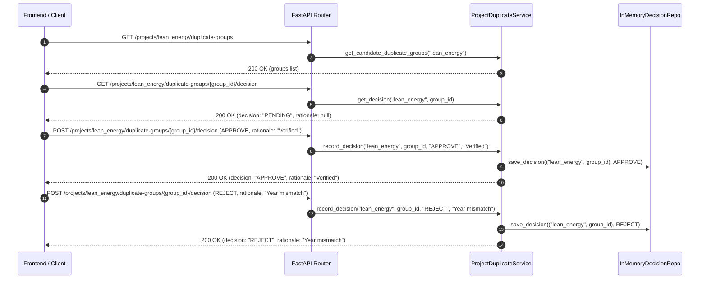

# SLR Platform — Duplicate Review Integration & Contract Testing (Phase 6.6)

## 1. Overview

**Phase 6.6 — Integration and Contract Tests** completes Phase 6 (GUI Foundation and Duplicate Review) by establishing a comprehensive regression and contract testing harness. It verifies the end-to-end duplicate review workflow, schema parity between Python backend DTOs and TypeScript frontend types, FastAPI OpenAPI v3 compliance, error recovery, and deterministic behavior.

---

## 2. Test Architecture & Directory Structure

Tests are organized strictly according to the project's Clean Architecture conventions:

```text
tests/
├── contract/
│   ├── api/
│   │   └── test_deduplication_contract.py      # HTTP endpoint & DTO/TypeScript schema contracts
│   └── services/
│       └── test_search_engine_contract.py
├── integration/
│   └── api/
│       └── test_deduplication_workflow_integration.py  # Full backend review lifecycle & determinism
└── unit/
    └── api/
        └── test_deduplication_api.py           # Unit API & service tests

frontend/tests/
├── DeduplicationView.test.tsx                  # Component & page view unit tests
└── DeduplicationIntegration.test.tsx           # Interactive user workflow & error recovery tests
```

---

## 3. Scope of Contract Tests

The contract test suite (`tests/contract/api/test_deduplication_contract.py`) covers:

1. **`GET /projects/{project_id}/duplicate-groups`**:
   - Validates JSON payload against `DuplicateGroupListResponse`.
   - Ensures `project_id`, `total_groups_count`, and `groups` collections conform strictly to type and non-nullability rules.
   - Enforces `extra="forbid"` compliance across `DuplicateGroupResponse`, `DuplicateRecordPreviewResponse`, `ProvenanceEntryResponse`, and `SharedIdentifierResponse`.
2. **`POST /projects/{project_id}/duplicate-groups/{group_id}/decision`**:
   - Validates request body schema (`DuplicateGroupDecisionRequest`) and response schema (`DuplicateGroupDecisionResponse`).
   - Verifies `decision` enum values (`APPROVE`, `REJECT`) and `rationale` string handling.
3. **`GET /projects/{project_id}/duplicate-groups/{group_id}/decision`**:
   - Verifies GET decision payload contract (`project_id`, `group_id`, `decision`, `rationale`).

---

## 4. Backend DTO ↔ Frontend TypeScript Parity Verification

The contract suite includes automated static reflection (`test_python_dto_to_typescript_types_parity_contract`) that parses `frontend/src/types/index.ts` and verifies that every field present in Python Pydantic DTOs exists with identical name and semantics in TypeScript interfaces:

| Python Backend DTO | TypeScript Frontend Interface |
| :--- | :--- |
| `DuplicateGroupListResponse` | `ApiDuplicateGroupListResponse` |
| `DuplicateGroupResponse` | `ApiDuplicateGroup` |
| `DuplicateRecordPreviewResponse` | `ApiDuplicateRecordPreview` |
| `ProvenanceEntryResponse` | `ApiProvenanceEntry` |
| `DuplicateGroupDecisionResponse` | `ApiDuplicateGroupDecisionResponse` |

---

## 5. OpenAPI v3 Verification

The OpenAPI contract test (`test_openapi_schema_contract`) extracts `app.openapi()` from the FastAPI app and verifies:
- Path registration for all 3 deduplication endpoints.
- Operation summaries and tags.
- Request body definitions for `DuplicateGroupDecisionRequest`, confirming `maxLength: 1000` on `rationale`.
- Enum specification for `DuplicateDecisionType` containing `["APPROVE", "REJECT"]`.

---

## 6. Full Duplicate Review Lifecycle Workflow

The integration test suite (`tests/integration/api/test_deduplication_workflow_integration.py`) tests the complete reviewer journey:



---

## 7. Determinism & Error Handling

- **Backend Determinism**: Multiple consecutive invocations of candidate group retrieval return identical JSON payloads with stable group order, record order within groups, and identifier/provenance ordering.
- **Frontend Determinism**: Field comparison badges (`MATCH`, `DIFFERENT`, `PARTIAL`, `UNAVAILABLE`) are computed deterministically from publication records.
- **Error Recovery**: Tests confirm error handling and retry mechanisms for GET network failure, POST decision failure, invalid decision enums (422), overlong rationales >1000 chars (422), and non-existent groups/projects (404).

---

## 8. Running the Test Suite

To run the complete test suite across backend and frontend:

```bash
# Backend Quality Gate (pytest, ruff, mypy)
.venv/bin/pytest
.venv/bin/ruff check app tests
.venv/bin/mypy app

# Frontend Quality Gate (type-check, vitest, build)
cd frontend
npm run type-check
npm run test
npm run build
```
