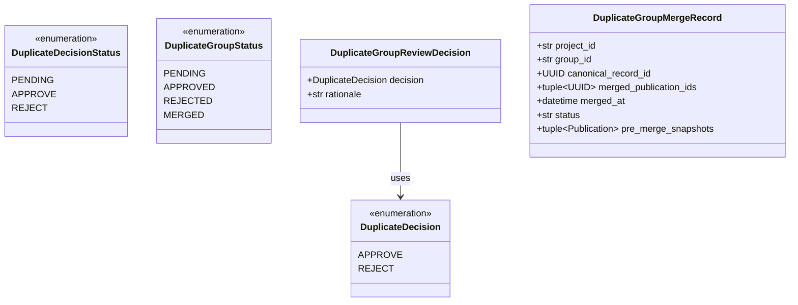
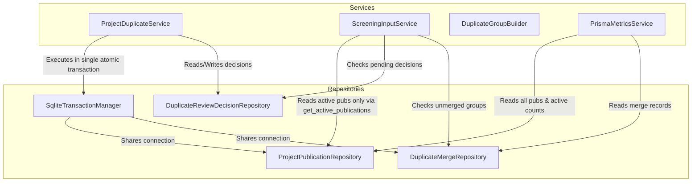
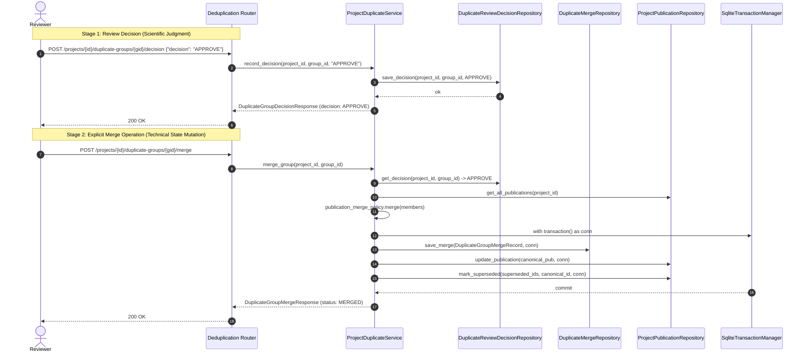

# Architectural Review & Redesign Plan: Canonical Duplicate Merge (v0.5.7)

**Document Reference**: `docs/planning/v0.5.7-canonical-duplicate-merge-redesign.md`
**Target Version**: v0.5.7
**Module**: Deduplication & Canonical Record Management (`app/services/project_duplicate_service.py`, `app/domain/deduplication.py`, `app/repositories/`)
**Status**: Plan / Architecture Review
**Date**: 2026-08-21

---

## Executive Summary

This document presents a comprehensive architectural review of the deduplication and duplicate-merge subsystem in SLR Platform, analyzes the uncommitted experimental changes on the working tree, and defines a minimal, safe, and robust redesign plan for version **v0.5.7**.

The goal of deduplication in the SLR Platform is to transition candidate duplicate publications through a strict two-stage lifecycle:
1. **Human Review Stage** (`PENDING` $\rightarrow$ `APPROVE` / `REJECT`): A researcher records a scientific judgment on whether candidate records represent the same underlying study.
2. **Technical Merge Stage** (`APPROVED` $\rightarrow$ `MERGE`): An explicit, atomic technical operation that merges metadata into exactly one active canonical publication, marks original member records as superseded (inactive), preserves all original records durably in storage, and persists the merge execution state.

---

## 1. Current Actual Behavior

### 1.1 Baseline System Behavior (Pre-Experiment)
Prior to the experimental changes:
* `DuplicateGroupBuilder` dynamically detects candidate duplicate groups by clustering records that share strong canonical identifiers (`DOI`, `PMID`, `OpenAlex ID`).
* Reviewers record `APPROVE` or `REJECT` decisions via `POST /api/v1/projects/{project_id}/duplicate-groups/{group_id}/decision`.
* Decisions are stored in SQLite in table `duplicate_review_decisions (project_id, group_id, decision, rationale, updated_at)` with a strict database check constraint: `CHECK (decision IN ('APPROVE', 'REJECT'))`.
* `ScreeningInputService` performs an **ad-hoc in-memory merge** whenever `decision == DuplicateDecision.APPROVE` by invoking `reduce(PublicationMergePolicy.merge, members)` on the fly when preparing the input set for Title & Abstract screening.
* Original records in `project_publications` are untouched, but no persistent merge entity or canonical record is stored.

### 1.2 Uncommitted Experimental Changes (`git diff`)
An experimental branch introduced the following changes:
* Added `MARK_MERGED` to `DuplicateDecision` enum (`app/domain/duplicate_review.py`) and `DuplicateDecisionType` (`app/api/dto/deduplication.py`).
* Added `MERGED` to `DuplicateDecisionStatus` (`app/api/dto/deduplication.py`).
* Modified domain model `DuplicateGroup` (`app/domain/deduplication.py`) to add `merge()` and fields `merged_at`, `canonical_record_id`, and `merged_publication_ids`.
* Added endpoint `POST /api/v1/projects/{project_id}/duplicate-groups/{group_id}/mark-merged` taking a `MarkMergedRequest` DTO.
* Implemented `ProjectDuplicateService.mark_merged()`:
  * Merges member records using `publication_merge_policy.merge()`.
  * Calls `ProjectPublicationRepository.replace_publications()`, which physically **deletes** original member publications from the database (`DELETE FROM project_publications ...`) and inserts only the single canonical record.
  * Writes a decision with `decision = DuplicateDecision.MARK_MERGED` into `duplicate_review_decisions`.
  * Ignores the incoming `MarkMergedRequest` payload parameters (`canonical_record_id`, `merged_publication_ids`).
  * Leaves `ScreeningInputService` unchanged (still performing independent in-memory merge on `APPROVE`).

---

## 2. Architectural Defects in Current Implementation

The defects identified in the current uncommitted state are classified below by severity:

```
+---------------------------------------------------------------------------------------+
| ARCHITECTURAL DEFECT SEVERITY MATRIX                                                  |
+---------------------------------------------------------------------------------------+
| CRITICAL | 1. Permanent Deletion of Original Source Publications                      |
|          | 2. Enum Pollution & Database CHECK Constraint Violation (MARK_MERGED)      |
+---------------------------------------------------------------------------------------+
| HIGH     | 3. Unpersisted Technical Merge State (Ephemeral Domain Model Fields)      |
|          | 4. Dual / Competing Merge Semantics (ScreeningInputService In-Memory Merge) |
|          | 5. Group Identity Dissolution & Orphaned Decision Audit Alerts             |
+---------------------------------------------------------------------------------------+
| MEDIUM   | 6. API DTO Parity & Ignored Request Payload Fields                         |
|          | 7. PRISMA Funnel Pre-Deduplication Count Distortion                       |
+---------------------------------------------------------------------------------------+
| LOW      | 8. Lack of Atomic Transaction Boundaries Across Multi-Table Merge Updates  |
+---------------------------------------------------------------------------------------+
```

### Defect 1: Permanent Deletion of Original Source Publications [CRITICAL]
* **Location**: `app/services/project_duplicate_service.py:226`
* **Description**: `mark_merged()` removes duplicate member publications from the project working collection and calls `replace_publications()`. In `SqliteProjectPublicationRepository`, this runs `DELETE FROM project_publications WHERE project_id = ?` followed by re-inserting only the remaining records plus the canonical record.
* **Impact**: Violates ADR-0005 (*Model danych z pełnym pochodzeniem rekordu*). Original source records and their raw provenance are destroyed. Reversing a merge or auditing individual source imports becomes impossible without re-importing raw provider files.

### Defect 2: Enum Pollution & Database CHECK Constraint Violation [CRITICAL]
* **Location**: `app/domain/duplicate_review.py:13`, `app/api/dto/deduplication.py:11`, `migrations/0006_duplicate_review_decisions.sql:4`
* **Description**: `MARK_MERGED` was added to `DuplicateDecision`. In `mark_merged()`, `_decision_repository.save_decision()` writes `DuplicateDecision.MARK_MERGED` into `duplicate_review_decisions`.
* **Impact**: `migrations/0006_duplicate_review_decisions.sql` defines `decision TEXT NOT NULL CHECK (decision IN ('APPROVE', 'REJECT'))`. Inserting `MARK_MERGED` violates the SQLite table constraint in production environments. Conceptually, a human review verdict (`APPROVE`/`REJECT`) is conflated with an automated system state transition (`MERGE`).

### Defect 3: Unpersisted Technical Merge State [HIGH]
* **Location**: `app/domain/deduplication.py:68-70`, `app/services/project_duplicate_service.py:228-234`
* **Description**: The fields `merged_at`, `canonical_record_id`, and `merged_publication_ids` were added to the ephemeral Pydantic model `DuplicateGroup`. However, no database table or repository exists to store this data.
* **Impact**: Merge metadata is lost immediately upon request completion. The system cannot answer when a merge occurred, which canonical record was produced, or which original publications were consolidated.

### Defect 4: Dual / Competing Merge Semantics in ScreeningInputService [HIGH]
* **Location**: `app/services/screening_input_service.py:84-86`
* **Description**: `ScreeningInputService` checks if `decision == DuplicateDecision.APPROVE`, and if so, runs `reduce(self._merge_policy.merge, members)` in memory.
* **Impact**: If `mark_merged()` also executes `publication_merge_policy.merge()`, there are two independent merge execution paths. If `mark_merged()` deletes records, `ScreeningInputService` fails to find the duplicate group; if records are preserved, `ScreeningInputService` merges them again on the fly, ignoring persisted merge state.

### Defect 5: Group Identity Dissolution & Integrity Audit Alerts [HIGH]
* **Location**: `app/services/duplicate_group_builder.py:100-113`, `app/services/integrity_audit_service.py:281-295`
* **Description**: `DuplicateGroupBuilder` rebuilds candidate groups dynamically from `ProjectPublicationRepository.get_publications()`. When member records disappear from the active collection, the group builder no longer generates the group aggregate.
* **Impact**: The candidate group disappears from `GET /duplicate-groups`. Furthermore, `IntegrityAuditService` checks stored decisions against dynamically generated candidate groups and raises `DEDUP_DECISION_ORPHANED` errors because the decision exists in the database for a group that the builder can no longer find.

### Defect 6: API Contract Divergence & Ignored Request Payload [MEDIUM]
* **Location**: `app/api/dto/deduplication.py:92-98`, `app/services/project_duplicate_service.py:198-202`
* **Description**: `MarkMergedRequest` defines `canonical_record_id: str` and `merged_publication_ids: list[str]`. `ProjectDuplicateService.mark_merged(project_id, group_id, payload)` accepts this object but completely ignores its fields, generating its own merge internally.
* **Impact**: Creates a misleading API contract. Frontend TypeScript definitions in `frontend/src/types/index.ts` do not match the modified backend enums.

### Defect 7: PRISMA Metric Distortion [MEDIUM]
* **Location**: `app/services/prisma_metrics_service.py:100-125`
* **Description**: `PrismaMetricsService` uses `self._publications.count_by_project(project_id)` to calculate `records_after_normalization` and `records_before_dedup`.
* **Impact**: When records are deleted from `project_publications` during deduplication, `records_before_dedup` erroneously reflects post-deduplication counts instead of the pre-deduplication identification baseline.

### Defect 8: Lack of Atomic Transaction Boundaries [LOW]
* **Location**: `app/services/project_duplicate_service.py:226-234`
* **Description**: The replacement of publication records, marking superseded records, and saving merge records are executed as separate SQLite connections/operations without a shared transaction context.

---

## 3. Recommended Target Data Model

The domain architecture strictly separates **Reviewer Decisions** (human verdicts) from **Duplicate Group Lifecycle Status** (aggregate state) and **Merge Execution Records** (system state mutations).



### 3.1 Strict Separation of Reviewer Decisions vs Group Lifecycle Status

| Concept | Enum Type | Allowed Values | Semantic Meaning |
| :--- | :--- | :--- | :--- |
| **Reviewer Decision Type** (Input) | `DuplicateDecision` / `DuplicateDecisionType` | `APPROVE`, `REJECT` | Input decision payload from reviewer. |
| **Reviewer Decision Status** (Response) | `DuplicateDecisionStatus` | `PENDING`, `APPROVE`, `REJECT` | Verdict state of reviewer decision. **`MERGED` NEVER appears here.** |
| **Group Lifecycle Status** (Aggregate/UI) | `DuplicateGroupStatus` | `PENDING`, `APPROVED`, `REJECTED`, `MERGED` | Full lifecycle state of a candidate duplicate group. |

1. **`DuplicateDecision`** (in `app/domain/duplicate_review.py`):
   ```python
   class DuplicateDecision(StrEnum):
       APPROVE = "APPROVE"
       REJECT = "REJECT"
   ```
2. **`DuplicateDecisionStatus`** (in `app/api/dto/deduplication.py`):
   ```python
   class DuplicateDecisionStatus(StrEnum):
       PENDING = "PENDING"
       APPROVE = "APPROVE"
       REJECT = "REJECT"
   ```
3. **`DuplicateGroupStatus`** (in `app/domain/deduplication.py` and `app/api/dto/deduplication.py`):
   ```python
   class DuplicateGroupStatus(StrEnum):
       PENDING = "pending"
       APPROVED = "approved"
       REJECTED = "rejected"
       MERGED = "merged"
   ```
4. **`DuplicateGroupReviewDecision`** (in `app/domain/duplicate_review.py`):
   Stores human reviewer verdict (`APPROVE` / `REJECT`) and optional rationale text ($\le 1000$ chars).

### 3.2 Technical Merge Entity
**`DuplicateGroupMergeRecord`** (in `app/domain/deduplication.py`):
```python
class DuplicateGroupMergeRecord(BaseModel):
    model_config = ConfigDict(extra="forbid", frozen=True)

    project_id: str = Field(min_length=1)
    group_id: str = Field(min_length=1)
    canonical_record_id: UUID
    merged_publication_ids: tuple[UUID, ...]
    merged_at: datetime = Field(default_factory=lambda: datetime.now(timezone.utc))
    status: str = "merged"  # "merged" | "reverted"
    pre_merge_snapshots: tuple[Publication, ...] = ()
```

---

## 4. Recommended Persistence Schema & Migrations

We introduce **Migration `0027_duplicate_group_merges.sql`** to create the dedicated merge table and extend `project_publications` with a `superseded_by` pointer.

```sql
-- migrations/0027_duplicate_group_merges.sql

-- 1. Extend project_publications with superseded_by pointer
ALTER TABLE project_publications ADD COLUMN superseded_by TEXT DEFAULT NULL;

CREATE INDEX IF NOT EXISTS idx_project_publications_superseded
    ON project_publications(project_id, superseded_by);

-- 2. Create durable duplicate group merge execution table
CREATE TABLE IF NOT EXISTS duplicate_group_merges (
    project_id TEXT NOT NULL,
    group_id TEXT NOT NULL,
    canonical_record_id TEXT NOT NULL,
    merged_publication_ids TEXT NOT NULL CHECK (json_valid(merged_publication_ids)),
    merged_at TEXT NOT NULL,
    status TEXT NOT NULL DEFAULT 'merged' CHECK (status IN ('merged', 'reverted')),
    pre_merge_snapshots TEXT NOT NULL CHECK (json_valid(pre_merge_snapshots)),
    created_at TEXT NOT NULL DEFAULT CURRENT_TIMESTAMP,
    PRIMARY KEY (project_id, group_id)
);

CREATE INDEX IF NOT EXISTS idx_duplicate_group_merges_project
    ON duplicate_group_merges(project_id);

CREATE INDEX IF NOT EXISTS idx_duplicate_group_merges_canonical
    ON duplicate_group_merges(project_id, canonical_record_id);
```

### Storage Semantics
* **Original Publications**: Never deleted. When imported, `superseded_by IS NULL`.
* **Canonical Record**: Retains stable `record_id = min(member_record_ids)`; its document is updated with deterministic merged metadata; `superseded_by` remains `NULL`.
* **Superseded Records**: Other member publications retain their original untouched documents; their `superseded_by` column is set to `canonical_record_id`.
* **Merge Execution Record**: `duplicate_group_merges` records the exact timestamp, canonical ID, member list, and a JSON snapshot of the pre-merge member publications.

---

## 5. Recommended Repository & Service Changes



### 5.1 `ProjectPublicationRepository` Changes (Preserving Default Semantics)

To prevent regressions across existing callers (`normalization_service`, `search_strategy`, `live_search`, etc.), the global default method `get_publications(project_id)` **preserves its exact existing baseline semantics** (returning all records in the working collection). Explicit methods are provided for targeted filtering:

* **`get_publications(project_id, connection=None)`**: Preserves existing behavior (returns all records for the project, ordered by position).
* **`get_all_publications(project_id, connection=None)`**: Explicit alias for `get_publications` when callers (e.g. duplicate group builder, audit services, import history reconciliation) explicitly require all records including superseded ones.
* **`get_active_publications(project_id, connection=None)`**: Explicitly queries only active, non-superseded records:
  ```sql
  SELECT document FROM project_publications
  WHERE project_id = ? AND superseded_by IS NULL
  ORDER BY position ASC, rowid ASC
  ```
  *(Used exclusively by `ScreeningInputService` for downstream Title & Abstract screening and subsequent workflow stages).*
* **`count_by_project(project_id, connection=None)`**: Total working collection count (preserves existing behavior).
* **`count_active_by_project(project_id, connection=None)`**: Returns count of active records (`COUNT(*) WHERE project_id = ? AND superseded_by IS NULL`).
* **`mark_superseded(project_id, record_ids, canonical_record_id, connection=None)`**: Updates `superseded_by` pointer for specified member IDs.
* **`update_publication(project_id, publication, connection=None)`**: Updates the canonical publication document and metadata in-place.

### 5.2 New `DuplicateMergeRepository`
* Interface `DuplicateMergeRepository(Protocol)`:
  * `save_merge(project_id, group_id, merge_record, connection=None)`
  * `get_merge(project_id, group_id, connection=None) -> DuplicateGroupMergeRecord | None`
  * `list_merges_for_project(project_id, connection=None) -> dict[str, DuplicateGroupMergeRecord]`
  * `delete_for_project(project_id, connection=None)`
* Implementations:
  * `SqliteDuplicateMergeRepository` backed by `duplicate_group_merges`.
  * `InMemoryDuplicateMergeRepository` for test isolation.

### 5.3 Atomic Canonical Merge Transaction Boundary

The technical merge execution spans multiple database updates. All three mutation steps **must execute within a single SQLite transaction** managed via `SqliteTransactionManager`:

```python
# ProjectDuplicateService.merge_group(project_id, group_id)
with self._transaction_manager.transaction() as conn:
    # Step 1: Save durable merge record (including pre-merge snapshots)
    self._merge_repo.save_merge(project_id, group_id, merge_record, connection=conn)

    # Step 2: Update canonical publication document with merged metadata
    self._publication_repo.update_publication(project_id, canonical_pub, connection=conn)

    # Step 3: Mark superseded source member publications
    self._publication_repo.mark_superseded(
        project_id,
        record_ids=superseded_ids,
        canonical_record_id=canonical_pub.record_id,
        connection=conn,
    )
```

If any step raises an error (e.g. disk I/O, lock contention, schema constraint failure), the entire transaction automatically rolls back. No partial or corrupt state can persist.

### 5.4 `ProjectDuplicateService` Changes
* **`get_candidate_duplicate_groups(project_id)`**:
  * Calls `_repository.get_all_publications(project_id)` so groups remain detectable and stable regardless of merge state.
  * Decorates each group with its review decision from `_decision_repository` and merge status from `_merge_repository`.
  * Group Lifecycle Status Resolution:
    * If merge record exists in `_merge_repository` $\rightarrow$ `DuplicateGroupStatus.MERGED`.
    * Else if decision in `_decision_repository` is `APPROVE` $\rightarrow$ `DuplicateGroupStatus.APPROVED`.
    * Else if decision in `_decision_repository` is `REJECT` $\rightarrow$ `DuplicateGroupStatus.REJECTED`.
    * Else $\rightarrow$ `DuplicateGroupStatus.PENDING`.
* **`record_decision(project_id, group_id, decision, rationale)`**:
  * Accepts only `APPROVE` or `REJECT`.
  * Rejects attempts to record a review decision on an already `MERGED` group.
* **`merge_group(project_id, group_id)`**:
  * Requires group decision to be `APPROVE`.
  * Validates group is not already merged.
  * Fetches all member publications via `get_all_publications`.
  * Computes canonical record using `PublicationMergePolicy.merge()`.
  * Prepares `DuplicateGroupMergeRecord` with full pre-merge snapshots.
  * Executes atomic database update across merge repository and publication repository.

### 5.5 `ScreeningInputService` Changes
* **Eliminate ad-hoc in-memory merge**: Remove `reduce(self._merge_policy.merge, members)`.
* **Readiness Evaluation**:
  * If any candidate group has decision `PENDING` $\rightarrow$ `UNRESOLVED_DUPLICATES`.
  * If any candidate group is `APPROVED` but has no merge record $\rightarrow$ `UNMERGED_DUPLICATES`.
  * If all groups are resolved (`REJECTED` or `MERGED`) $\rightarrow$ `READY`.
* **Input Set Construction**:
  * Calls `_publications.get_active_publications(project_id)`.
  * Returns active canonical publications sorted deterministically by `record_id`.

---

## 6. Recommended API Design



### API Endpoints Specification

#### 1. `GET /api/v1/projects/{project_id}/duplicate-groups`
* **Summary**: List candidate duplicate groups with current lifecycle status.
* **Status**: `200 OK`.
* **Response DTO**: `DuplicateGroupListResponse`:
  ```json
  {
    "project_id": "lean_energy",
    "total_groups_count": 1,
    "groups": [
      {
        "group_id": "8a7c29e1-6b45-562a-89bc-31e9c2012345",
        "reason": "Zgodność identyfikatorów (DOI: 10.1016/j.jclepro.2021.102834)",
        "records_count": 2,
        "status": "MERGED",
        "rationale": "Verified matching full text.",
        "shared_identifiers": [{"identifier_type": "doi", "value": "10.1016/j.jclepro.2021.102834"}],
        "records": [...]
      }
    ]
  }
  ```
* **Group `status` Field**: Uses `DuplicateGroupStatus` (`"PENDING"`, `"APPROVED"`, `"REJECTED"`, `"MERGED"`).

#### 2. `POST /api/v1/projects/{project_id}/duplicate-groups/{group_id}/decision`
* **Summary**: Record human reviewer verdict.
* **Request DTO**: `DuplicateGroupDecisionRequest`:
  ```json
  {
    "decision": "APPROVE",
    "rationale": "Same clinical trial, published across Crossref and OpenAlex."
  }
  ```
  *(Allowed decision values: `"APPROVE"`, `"REJECT"` only).*
* **Status**: `200 OK`.
* **Response DTO**: `DuplicateGroupDecisionResponse`:
  ```json
  {
    "project_id": "lean_energy",
    "group_id": "8a7c29e1-6b45-562a-89bc-31e9c2012345",
    "decision": "APPROVE",
    "rationale": "Same clinical trial, published across Crossref and OpenAlex."
  }
  ```

#### 3. `GET /api/v1/projects/{project_id}/duplicate-groups/{group_id}/decision`
* **Summary**: Retrieve recorded reviewer decision.
* **Status**: `200 OK`.
* **Response DTO**: `DuplicateGroupDecisionResponse`:
  ```json
  {
    "project_id": "lean_energy",
    "group_id": "8a7c29e1-6b45-562a-89bc-31e9c2012345",
    "decision": "APPROVE",
    "rationale": "Same clinical trial, published across Crossref and OpenAlex."
  }
  ```
  *(Returns `"decision": "PENDING"` if undecided. **`"MERGED"` NEVER appears in decision endpoint responses**).*

#### 4. `POST /api/v1/projects/{project_id}/duplicate-groups/{group_id}/merge`
* **Summary**: Execute technical canonical merge for an approved duplicate group.
* **Preconditions**:
  * Group must exist in project.
  * Group must have reviewer decision `APPROVE`.
  * Group must not be already `MERGED`.
* **Request Body**: Empty `{}`.
* **Status**: `200 OK`.
* **Response DTO**: `DuplicateGroupMergeResponse`:
  ```json
  {
    "project_id": "lean_energy",
    "group_id": "8a7c29e1-6b45-562a-89bc-31e9c2012345",
    "status": "MERGED",
    "canonical_record_id": "00000000-0000-0000-0000-000000000101",
    "merged_publication_ids": [
      "00000000-0000-0000-0000-000000000101",
      "00000000-0000-0000-0000-000000000102"
    ],
    "merged_at": "2026-08-21T10:00:00Z"
  }
  ```
* **Errors**:
  * `422 Unprocessable Content`: Group is not in `APPROVE` state or is already merged.
  * `404 Not Found`: Project or group not found.

---

## 7. Downstream Filtering Strategy

```
+-----------------------------------------------------------------------------+
| DATA FLOW & DOWNSTREAM FILTERING ARCHITECTURE                               |
+-----------------------------------------------------------------------------+
| [Raw Imports / Files]                                                       |
|       │                                                                     |
|       ▼                                                                     |
| [project_publications] (All Records: Active + Superseded)                   |
|       │                                                                     |
|       ├──────────────────────────────┐                                      |
|       │ (get_all_publications)       │ (get_active_publications)            |
|       ▼                              ▼                                      |
| [DuplicateGroupBuilder]      [ScreeningInputService]                        |
|   (Auditing & Review)                │                                      |
|                                      ▼                                      |
|                          [Title & Abstract Screening]                       |
|                                      │ (INCLUDE)                            |
|                                      ▼                                      |
|                             [Full-Text Screening]                           |
|                                      │ (INCLUDE)                            |
|                                      ▼                                      |
|                          [Quality Assessment (QA)]                          |
|                                      │                                      |
|                                      ▼                                      |
|                         [Data Extraction & Synthesis]                       |
+-----------------------------------------------------------------------------+
```

1. **Title & Abstract Screening**: Receives `ScreeningInput.publications` from `ScreeningInputService`, which calls `get_active_publications(project_id)`.
2. **Full-Text Screening**: Operates strictly on publications that received `INCLUDE` outcomes at Title & Abstract screening.
3. **Quality Assessment, Extraction, Synthesis**: Operate on publications that received `INCLUDE` outcomes at Full-Text screening.
4. **Guaranteed Downstream Isolation**: Because Title & Abstract screening only ever sees active canonical records, superseded duplicate source records never propagate into any downstream stage.

---

## 8. Canonical Record Selection Rule

* **Rule**: The canonical `record_id` is selected deterministically as the minimum UUID among all member publications:
  $$\text{canonical\_record\_id} = \min_{p \in \text{members}} (p.\text{record\_id})$$
* **Rationale**:
  1. **Stability**: Retains a pre-existing stable UUID already associated with one of the records.
  2. **Deterministic & Commutative**: The result is identical regardless of input record ordering or repository retrieval order.
  3. **Codebase Parity**: Matches the established behavior in `app/services/publication_merge_policy.py:173` (`record_id: min(first.record_id, second.record_id)`).

---

## 9. Metadata Merge Policy & Bibliographic Date Resolution

The metadata merge policy reuses `PublicationMergePolicy`.

### 9.1 Bibliographic Date Merge Resolution
In `PublicationMergePolicy`, bibliographic date selection is governed by `_bibliographic_date_key`:
```python
def _bibliographic_date_key(
    value: tuple[date | None, int | None],
) -> tuple[bool, bool, str, int]:
    publication_date, publication_year = value
    return (
        publication_date is not None,
        publication_year is not None,
        publication_date.isoformat() if publication_date is not None else "",
        publication_year if publication_year is not None else 0,
    )
```

The merge selection follows these deterministic criteria:
1. **Precision First**: A record containing a complete `publication_date` (`YYYY-MM-DD`) is strictly preferred over a record with only `publication_year` (`YYYY`).
2. **Value Presence**: A record with a valid publication date or year is preferred over null values.
3. **Year/Date Consistency**: `Publication` model validation enforces that `publication_date.year == publication_year`.
4. **Deterministic Tie-Breaking**: When precision is identical, tie-breaking is achieved deterministically via stable ISO formatted string and integer comparison.
*(The system does **not** prefer a date simply because it is chronologically later; it prioritizes validity, completeness, and precision).*

### 9.2 Field-by-Field Merge Policy Summary

| Field | Merge Selection Policy |
| :--- | :--- |
| **`record_id`** | Minimum member `UUID` ($\min(p.\text{record\_id})$). |
| **`schema_version`** | Must match across records (conflict raised if mismatched). |
| **`title`** | Deterministic richest non-empty title (maximum length, fallback to casefold/lexicographical). |
| **`title_normalized`** | Computed from chosen canonical title using `normalize_title()`. |
| **`abstract`** | Longest non-empty abstract text. |
| **`authors`** | Most complete author list based on completeness scoring (author count + presence of given/family names, identifiers, affiliations). |
| **`publication_date` / `year`** | Highest precision valid date (full `date` preferred over year-only), consistent with publication year, with deterministic tie-break. |
| **`identifiers`** | Deterministic union of normalized unique identifiers sorted by `(type, normalized_value, source)`. |
| **`venue`** | Most complete venue object based on completeness scoring (name, publisher, identifiers). |
| **`publisher`** | Longest non-empty publisher string. |
| **`document_type`** | Deterministic non-null selection (`_choose_optional`). |
| **`language`** | Must not conflict (if both non-null and unequal, conflict raised; otherwise non-null chosen). |
| **`keywords`** | Deduplicated, case-normalized, sorted list union. |
| **`urls`** | Deduplicated, sorted list union. |
| **`open_access`** | Must not conflict (if unequal boolean values present, conflict raised). |
| **`provenance`** | Deterministic union of all `ProvenanceEntry` records from all source members, sorted stably. |
| **`created_at`** | Earliest timestamp ($\min(p.\text{created\_at})$). |

---

## 10. PRISMA Implications

```
+--------------------------------------------------------------------------------------+
| PRISMA FUNNEL STAGES AND METRICS FORMULATION                                         |
+--------------------------------------------------------------------------------------+
| Stage 1: Identification                                                              |
|   records_identified_providers = SUM(import_history.records_count WHERE provider)    |
|   records_identified_imports   = SUM(import_history.records_count WHERE file)        |
|   total_identified             = records_identified_providers + imports              |
|                                                                                      |
| Stage 2: Normalization & Pre-Deduplication                                           |
|   records_after_normalization  = COUNT(*) FROM project_publications (Total)         |
|   records_before_dedup         = COUNT(*) FROM project_publications (Total)         |
|                                                                                      |
| Stage 3: Technical Deduplication                                                     |
|   records_after_technical_merger = COUNT(*) FROM project_publications                |
|                                    WHERE superseded_by IS NULL (Active Only)         |
|   duplicates_removed           = records_before_dedup - records_after_merger         |
|                                                                                      |
| Stage 4: Screening (Downstream)                                                      |
|   records_screened_title_abstract = evaluated count from active canonical records    |
|   records_screened_full_text     = evaluated count from included canonical records   |
|   studies_included_synthesis     = eligible count from included full-text records    |
+--------------------------------------------------------------------------------------+
```

1. **Identification Counts**:
   * Derived from `import_history` and total rows in `project_publications`.
   * Preserving superseded records guarantees that deduplication merges **never reduce or distort** the initial identification metrics.
2. **Post-Deduplication Count**:
   * Equals the active canonical publication count (`count_active_by_project`).
3. **Provenance Integrity**:
   * The canonical publication's `provenance` array contains the union of provenance entries from all original records, maintaining end-to-end citation and database attribution traceability.

---

## 11. Auditability & Reversibility Strategy

### 11.1 Full Audit Trail
* Reviewer verdicts are permanently stored in `duplicate_review_decisions`.
* Technical merge operations are permanently stored in `duplicate_group_merges`.
* All candidate groups remain queryable in `GET /duplicate-groups` with status `MERGED` and complete record previews.
* `IntegrityAuditService` validates:
  * That all candidate group members exist in `project_publications`.
  * That merged groups have valid corresponding `duplicate_group_merges` records.
  * That exactly one member is active (`superseded_by IS NULL`) and all others point to that canonical ID.

### 11.2 Reversibility
* `duplicate_group_merges` stores `pre_merge_snapshots` containing the exact JSON serialized state of all member publications prior to merge.
* To unmerge a group (e.g. via future endpoint or administrative tool):
  1. Restore the canonical publication document to its pre-merge snapshot.
  2. Clear `superseded_by = NULL` on all other member records in `project_publications`.
  3. Mark or remove the record in `duplicate_group_merges`.
* **Zero Re-Import Guarantee**: Merge reversal is 100% self-contained and instantaneous without re-reading source files.

---

## 12. Backward Compatibility & Migration Concerns

1. **Database Schema**:
   * Migration `0027_duplicate_group_merges.sql` uses `ALTER TABLE project_publications ADD COLUMN superseded_by TEXT DEFAULT NULL;` and `CREATE TABLE IF NOT EXISTS duplicate_group_merges`.
   * Fully backward compatible with existing SQLite databases and existing rows.
2. **Repository Compatibility**:
   * `ProjectPublicationRepository.get_publications(project_id)` retains its baseline signature and semantics, preventing regressions across the entire codebase.
   * `get_active_publications(project_id)` provides explicit filtering for downstream consumers.
3. **API Compatibility**:
   * `GET /duplicate-groups/{group_id}/decision` returns `decision: "PENDING" | "APPROVE" | "REJECT"`.
   * `GET /duplicate-groups` returns `status: "PENDING" | "APPROVED" | "REJECTED" | "MERGED"`.
   * Frontend TypeScript interfaces in `frontend/src/types/index.ts` remain fully compliant.
4. **Migration Reconciliation**:
   * Numbered strictly as `0027_duplicate_group_merges.sql`, placed after `0026_synthesis_snapshots.sql`.
   * Reconciles cleanly across fresh DBs, development DBs, and synthesis branches.

---

## 13. Exact Files Likely to Change

```
┌───────────────────────────────────────────────────────────────────────────────┐
│ FILE CHANGE MANIFEST (v0.5.7 Implementation Scope)                            │
├───────────────────────────────────────────────────────────────────────────────┤
│ Schema & Migrations:                                                          │
│  + migrations/0027_duplicate_group_merges.sql                                  │
│                                                                               │
│ Domain Layer:                                                                 │
│  ~ app/domain/duplicate_review.py                                             │
│  ~ app/domain/deduplication.py                                                │
│                                                                               │
│ API & DTOs:                                                                   │
│  ~ app/api/dto/deduplication.py                                               │
│  ~ app/api/routers/deduplication.py                                           │
│                                                                               │
│ Repositories:                                                                 │
│  + app/repositories/duplicate_merge_repository.py                             │
│  ~ app/repositories/project_publication_repository.py                         │
│                                                                               │
│ Services:                                                                     │
│  ~ app/services/project_duplicate_service.py                                  │
│  ~ app/services/screening_input_service.py                                    │
│  ~ app/services/prisma_metrics_service.py                                     │
│  ~ app/services/integrity_audit_service.py                                    │
│                                                                               │
│ Test Suite:                                                                   │
│  + tests/unit/repositories/test_sqlite_duplicate_merge_repository.py          │
│  ~ tests/unit/repositories/test_sqlite_project_publication_repository.py      │
│  ~ tests/unit/domain/test_deduplication.py                                    │
│  ~ tests/unit/api/test_deduplication_api.py                                   │
│  ~ tests/unit/services/test_screening_input_service.py                        │
│  ~ tests/unit/services/test_prisma_metrics_service.py                         │
│  ~ tests/unit/services/test_integrity_audit_service.py                        │
│  ~ tests/contract/api/test_deduplication_contract.py                          │
│  ~ tests/integration/api/test_deduplication_workflow_integration.py           │
└───────────────────────────────────────────────────────────────────────────────┘
```

---

## 14. Tests that Must Be Added / Updated

1. **Repository Unit Tests**:
   * `test_sqlite_duplicate_merge_repository_save_get_list`: Verifies SQLite roundtrip of `DuplicateGroupMergeRecord` including JSON serialization of snapshots.
   * `test_project_publication_repository_active_filtering`: Verifies `get_active_publications()` ignores superseded records while `get_publications()` / `get_all_publications()` return all records.
   * `test_project_publication_repository_mark_superseded`: Verifies setting `superseded_by` pointer.
   * `test_atomic_merge_transaction_rollback`: Verifies that a failure during merge execution rolls back all table updates.
2. **Domain Unit Tests**:
   * `test_duplicate_decision_enum`: Verifies `DuplicateDecision` contains only `APPROVE` and `REJECT`.
   * `test_duplicate_group_merge_state`: Verifies `DuplicateGroupMergeRecord` validation and immutability.
3. **Service Unit Tests**:
   * `test_project_duplicate_service_record_decision_does_not_delete_or_merge`: Verifies `APPROVE` only records reviewer decision.
   * `test_project_duplicate_service_merge_group_success`: Verifies explicit merge creates canonical record, marks members superseded, persists merge record, and preserves original records.
   * `test_project_duplicate_service_merge_unapproved_group_fails`: Verifies merging a pending or rejected group raises `ValueError` / error.
   * `test_screening_input_service_consumes_active_records`: Verifies `ScreeningInputService` does not run in-memory merge and delivers only active canonical records.
   * `test_screening_input_service_blocks_on_unmerged_approved_group`: Verifies screening is blocked if approved duplicates have not been merged.
4. **Contract & Integration Tests**:
   * `test_deduplication_contract`: Restores schema assertion `set(decision_type_schema["enum"]) == {"APPROVE", "REJECT"}` and validates `/merge` endpoint schema.
   * `test_full_duplicate_review_and_merge_workflow_integration`: Tests full sequence: List $\rightarrow$ Decide `APPROVE` $\rightarrow$ Execute `POST /merge` $\rightarrow$ Verify candidate group status is `MERGED` $\rightarrow$ Verify active publications count $\rightarrow$ Verify screening readiness $\rightarrow$ Verify PRISMA counts.

---

## 15. Step-by-Step Implementation Plan for Codex

### Phase 1: Domain & DTO Cleanup
1. Revert `MARK_MERGED` from `DuplicateDecision` in `app/domain/duplicate_review.py`.
2. Revert `MARK_MERGED` from `DuplicateDecisionType` and `DuplicateDecisionStatus` in `app/api/dto/deduplication.py`.
3. Add `DuplicateGroupStatus` enum in `app/domain/deduplication.py` and `app/api/dto/deduplication.py`.
4. Add `DuplicateGroupMergeRecord` in `app/domain/deduplication.py`.
5. Add `DuplicateGroupMergeResponse` in `app/api/dto/deduplication.py`.

### Phase 2: Persistence Layer & Migrations
6. Create `migrations/0027_duplicate_group_merges.sql` defining `duplicate_group_merges` table and `ALTER TABLE project_publications ADD COLUMN superseded_by TEXT DEFAULT NULL;`.
7. Implement `DuplicateMergeRepository` and `SqliteDuplicateMergeRepository` in `app/repositories/duplicate_merge_repository.py`.
8. Update `ProjectPublicationRepository` and `SqliteProjectPublicationRepository`:
   * Preserve existing `get_publications(project_id)` semantics.
   * Add `get_active_publications(project_id)` and `get_all_publications(project_id)`.
   * Add `count_active_by_project(project_id)`.
   * Add `mark_superseded` and `update_publication` supporting connection parameter for transactions.

### Phase 3: Service Layer Refactoring
9. Update `ProjectDuplicateService`:
   * Inject `DuplicateMergeRepository` and `SqliteTransactionManager`.
   * Ensure `get_candidate_duplicate_groups` loads all publications via `get_all_publications` and sets group `status` to `DuplicateGroupStatus.MERGED` if a merge record exists.
   * Refactor `record_decision()` to support strictly `APPROVE` / `REJECT`.
   * Implement `merge_group(project_id, group_id)`: validates `APPROVE`, executes within `transaction_manager.transaction()`, saves `DuplicateGroupMergeRecord`, updates canonical record, and marks members superseded.
10. Update `ScreeningInputService`:
    * Remove ad-hoc in-memory `reduce(self._merge_policy.merge, members)`.
    * Verify readiness against unresolved and unmerged groups.
    * Fetch active canonical records via `get_active_publications(project_id)`.
11. Update `PrismaMetricsService` and `IntegrityAuditService` to respect superseded records and maintain audit stability.

### Phase 4: API Router & Contract Parity
12. Update `app/api/routers/deduplication.py`:
    * Ensure `POST /{project_id}/duplicate-groups/{group_id}/decision` accepts `DuplicateGroupDecisionRequest` (`APPROVE` / `REJECT`).
    * Implement `POST /{project_id}/duplicate-groups/{group_id}/merge` returning `DuplicateGroupMergeResponse`.
    * Remove experimental `mark-merged` endpoint.

### Phase 5: Verification & Testing
13. Update unit tests in `tests/unit/domain/`, `tests/unit/repositories/`, `tests/unit/services/`, and `tests/unit/api/`.
14. Update contract test `tests/contract/api/test_deduplication_contract.py`.
15. Add integration test `tests/integration/api/test_deduplication_merge_integration.py`.
16. Run full test suite (`pytest`) and verify 100% pass rate with zero integrity/reconciliation violations.

---

## 16. Explicit Review Answers

### A. Is the current uncommitted implementation safe to commit?
> **NO.**
> The current uncommitted code contains critical defects: it permanently deletes original duplicate publication records from the database, introduces invalid enum values (`MARK_MERGED`) that violate SQLite check constraints, fails to persist technical merge state in any database table, leaves competing in-memory merge logic in `ScreeningInputService`, breaks candidate group audit history, and ignores request payloads.

### B. Should we salvage it incrementally or replace the merge portion with a cleaner implementation?
> **Replace the merge portion with a cleaner implementation.**
> We should preserve the basic domain validation rules on `DuplicateGroup` transitions, but completely replace the `mark_merged` service implementation, API contract, and repository interactions with the dedicated `duplicate_group_merges` persistence model, atomic SQLite transaction boundaries, and `superseded_by` publication tracking.

### C. Is a database migration required?
> **YES.**
> Migration `0027_duplicate_group_merges.sql` is required to create the `duplicate_group_merges` table and add the `superseded_by` column to `project_publications`.

### D. Should ScreeningInputService stop doing its own in-memory merge?
> **YES.**
> `ScreeningInputService` must stop ad-hoc in-memory merging. It must act as an authoritative gate that verifies deduplication readiness and reads persisted, active canonical publications directly from `ProjectPublicationRepository.get_active_publications()`.

### E. What is the smallest safe v0.5.7 scope?
> The smallest safe v0.5.7 scope consists of:
> 1. Restoring `DuplicateDecision` / `DuplicateDecisionType` / `DuplicateDecisionStatus` to strictly `APPROVE` and `REJECT` (with `PENDING` for status).
> 2. Introducing `DuplicateGroupStatus` for group lifecycle (`PENDING`, `APPROVED`, `REJECTED`, `MERGED`).
> 3. Migration `0027_duplicate_group_merges.sql` for merge state storage and `superseded_by` tracking.
> 4. `SqliteDuplicateMergeRepository` to durably persist `group_id`, `canonical_record_id`, `merged_publication_ids`, `merged_at`, and pre-merge snapshots.
> 5. `ProjectPublicationRepository` preserving existing `get_publications` default while adding `get_active_publications` and `get_all_publications`.
> 6. Atomic merge execution in `ProjectDuplicateService.merge_group()` via `SqliteTransactionManager`.
> 7. `ScreeningInputService` reading active canonical records via `get_active_publications()`.
> 8. API endpoint `POST /projects/{project_id}/duplicate-groups/{group_id}/merge`.
> 9. Comprehensive test coverage for persistence, reversibility, atomicity, and contract parity.
