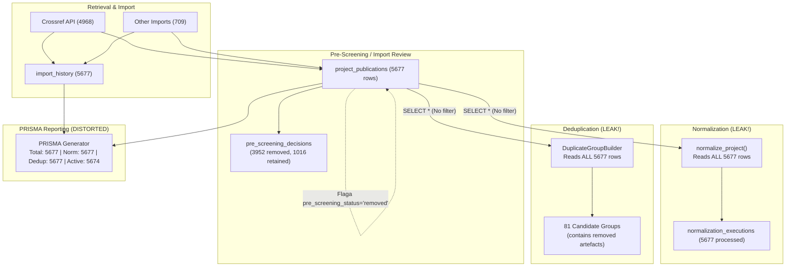
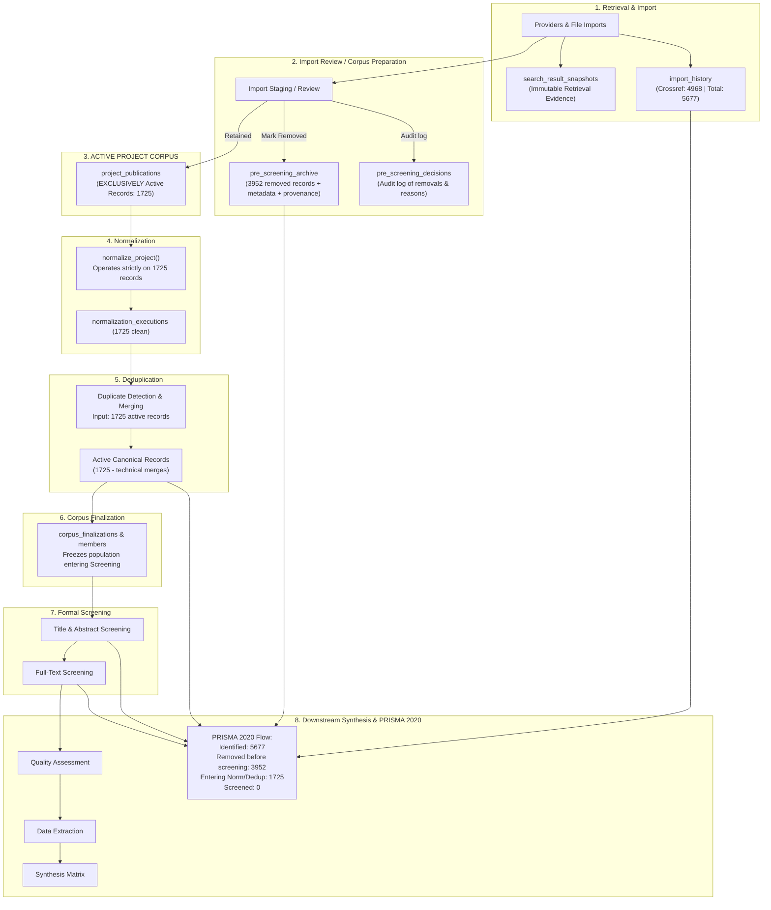

# Plan Poprawki SLR Platform v0.7.1: Integralność Korpusu Pipeline
**Pre-Screening → Normalization → Deduplication → Corpus Finalization → Screening → PRISMA**

---

## 1. Executive Summary

W wersji v0.7.0 wprowadzono mechanizm Pre-Screeningu (Import Review), który pozwalał na oznaczanie oczywistych artefaktów retrieval jako `pre_screening_status = 'removed'`. Rekordy te pozostały jednak fizycznie w tabeli `project_publications`. 

Audyt end-to-end ujawnił krytyczną nieszczelność danych:
1. **Normalization Service** odczytuje wszystkie wiersze z `project_publications` bez filtrowania po statusie, przetwarzając 5677 rekordów zamiast 1725 aktywnych.
2. **Deduplication Service** pobiera pełną zawartość `project_publications` do budowy grup duplikatów, tworząc 81 grup kandydatów (często obejmujących lub złożonych w całości z odrzuconych artefaktów).
3. **PRISMA Metrics Service** raportuje 5677 rekordów jako wchodzących do normalizacji i deduplikacji, zniekształcając obraz procesu badawczego.

Zgodnie ze skorygowanym wymaganiem produktowym, **odrzucone artefakty retrieval muszą zostać fizycznie usunięte z aktywnej tabeli `project_publications`**, a ich pełna historia, provenance i dane bibliograficzne muszą zostać przeniesione do dedykowanego, trwałego rejestru audytowego (`pre_screening_archive`). Cały downstream pipeline (Normalization, Deduplication, Corpus Finalization, Screening, QA, Extraction, Synthesis, PRISMA) operuje wówczas wyłącznie na jednolitym, aktywnym korpusie projektu.

---

## 2. Current Production State

### 2.1 Kontekst Projektu i Środowiska
- **Project ID**: `lean-green-phd-d05d3d`
- **Produkcja DB**: `/data/compose/18/data/slr-platform.db`
- **Crossref Import ID**: `0f909ad4-be38-43cf-8df8-c6044f9abe65`

### 2.2 Stan Liczbowy w Produkcji (Stan Zmierzony)
| Wskaźnik | Wartość w Produkcji | Opis |
|---|---|---|
| Crossref Pobrane / Zaimportowane | **4968** | Po technicznych filtrach providera |
| Crossref Oznaczone jako Retained | **1016** | Zakwalifikowane do korpusu projektu |
| Crossref Oznaczone jako Removed | **3952** | Odrzucone oczywiste artefakty retrieval |
| Inne Źródła / Importy | **709** | Rekordy z pozostałych importów |
| **Łącznie Rekordów w `project_publications`** | **5677** | 4968 (Crossref) + 709 (Inne) |
| UI Normalization: Processed Records | **5677** | Nieszczelność: przetwarza usunięte rekordy |
| UI Normalization: Clean Canonical Records | **5677** | Nieszczelność: zapisuje znormalizowane usunięte rekordy |
| PRISMA: Database records | **5677** | Pobrane ze wszystkich importów |
| PRISMA: Technical duplicates merged | **3** | Scalone rekordy |
| PRISMA: Candidate groups pending review | **81** | Grupy utworzone z uwzględnieniem 3952 usuniętych rekordów |
| PRISMA: Active canonical records | **5674** | Zawyżone o 3952 odrzucone rekordy |
| PRISMA: Title & Abstract screened | **0** | Formalny screening jeszcze nierozpoczęty |

---

## 3. Root Cause Analysis (Analiza Przyczyn Źródłowych)

### 3.1 Normalization Leak
W pliku [`app/services/normalization_service.py`](file:///home/cloud/dev/slr-platform/app/services/normalization_service.py#L57-L65):
```python
def normalize_project(repository: ProjectPublicationRepository, project_id: str) -> NormalizationExecution:
    publications = repository.get_publications(project_id)
    normalized = [normalize_publication(publication) for publication in publications]
    repository.replace_publications(project_id, normalized)
```
Metoda `repository.get_publications(project_id)` w [`SqliteProjectPublicationRepository`](file:///home/cloud/dev/slr-platform/app/repositories/project_publication_repository.py#L508-L519) wykonuje zapytanie:
```sql
SELECT document FROM project_publications WHERE project_id = ? ORDER BY position ASC, rowid ASC
```
Brak klauzuli filtrującej `pre_screening_status` sprawia, że Normalizacja ładuje i przetwarza wszystkie 5677 rekordów, a następnie `replace_publications` nadpisuje całą kolekcję roboczą, utrwalając znormalizowane wersje odrzuconych artefaktów.

### 3.2 Deduplication Leak
W pliku [`app/services/project_duplicate_service.py`](file:///home/cloud/dev/slr-platform/app/services/project_duplicate_service.py#L122-L131):
```python
publications = self._repository.get_all_publications(project_id)
live_groups = {str(group.group_id): group for group in self._builder.build(publications)}
```
Metoda `get_all_publications` jest aliasem do `get_publications`. `DuplicateGroupBuilder` buduje graf duplikatów ze wszystkich 5677 rekordów, przez co odrzucone artefakty wchodzą do klastrów duplikatów, generując 81 grup oczekujących na review.

### 3.3 PRISMA Metrics Distortion
W pliku [`app/services/prisma_metrics_service.py`](file:///home/cloud/dev/slr-platform/app/services/prisma_metrics_service.py#L112-L135):
- `working_count` jest wyliczane jako `count_by_project` (5677).
- `records_after_normalization` oraz `records_before_dedup` przyjmują wartość `working_count` (5677).
- `groups` są budowane z `get_publications` (wszystkich 5677), dając 81 grup.
W efekcie raport PRISMA nie odzwierciedlał przygotowania korpusu, a usunięte rekordy były traktowane jako część aktywnego strumienia badawczego.

---

## 4. Current Data-Flow Map (Stan Obecny z Wadami)



---

## 5. Target Data-Flow (Docelowy Przepływ Danych v0.7.1)



---

## 6. Work Packages Breakdown (Struktura Realizacji v0.7.1)

### WP1 — Active Corpus + Pre-Screening Archive Foundation
- **Scope**:
  - Implementacja jednoznacznego, autorytatywnego punktu dostępu do aktywnego korpusu w warstwie domenowej/repozytorium (`get_active_project_publications` / `get_active_publications`).
  - Utworzenie schematu SQLite i migracji `0032_pre_screening_archive.sql` dla niemutowalnego archiwum odrzuconych artefaktów (`pre_screening_archive`).
  - Rozgraniczenie odpowiedzialności: `pre_screening_decisions` (operacyjna/audytowa historia decyzji) vs `pre_screening_archive` (pełny snapshot bibliograficzny i provenance usuniętego rekordu).
  - Implementacja domenowej operacji archiwizacji `archive_pre_screening_removal` (transakcyjne przeniesienie snapshotu, ochrona przed usunięciem z innego projektu, zachowanie DOI/autorów/provenance/raw JSON, brak tworzenia formalnych decyzji screeningowych).
  - Zachowanie pełnej kompatybilności wstecznej dla rekordów legacy (`pre_screening_status = 'removed'`).
- **Dependencies**: Brak (baza od `origin/development`).
- **Invariants**:
  - I5: Fizyczne usunięcie rekordu z `project_publications` nie niszczy historii retrieval, provenance, DOI, ani metadanych (są one w 100% zachowane w `pre_screening_archive`).
  - I6: Historyczne liczniki providerów i importów w `import_history` pozostają w 100% powtarzalne i niezmienne.
  - I10: Istnieje jedna autorytatywna definicja aktywnego korpusu.
  - I11: Istniejące projekty legacy pozostają czytelne.
- **Tests**:
  - Testy repozytorium i serwisu archiwizacji (A–J: zachowanie metadanych, brak wycieku do aktywnego korpusu, idempotentność, izolacja projektowa, brak formalnych decyzji screeningowych).
  - Testy migracji schematu na świeżej i istniejącej bazie SQLite.
- **Acceptance Criteria**:
  - Schemat `pre_screening_archive` utworzony i zarejestrowany w `schema_migrations`.
  - Operacja archiwizacji działa transakcyjnie i bezpiecznie.
  - Aktywny korpus jest jednoznacznie zdefiniowany i odizolowany od rekordów usuniętych/zarchiwizowanych.
- **Explicit Out-of-Scope**:
  - Modyfikacja serwisów Normalization, Deduplication i PRISMA (przesunięte do WP2 i WP3).
  - Modyfikacja bazy produkcyjnej lub masowe usuwanie istniejących rekordów produkcyjnych (przesunięte do WP4).

---

### WP2 — Normalization + Deduplication Integration
- **Scope**:
  - Przepięcie `NormalizationService` na autorytatywny aktywny korpus (`get_active_publications`).
  - Przepięcie `ProjectDuplicateService` na autorytatywny aktywny korpus.
  - Zapewnienie, że wielokrotne uruchomienie normalizacji lub deduplikacji nie może przywrócić zarchiwizowanych rekordów (brak resurrection).
  - Bezpieczna rekoncyliacja stanu grup duplikatów i scalonych wpisów przy wykluczeniu zarchiwizowanych rekordów.
- **Dependencies**: WP1.
- **Invariants**:
  - I1: Rekord usunięty podczas Import Review nigdy nie trafia do wejścia ani wyjścia Normalizacji.
  - I2: Rekord usunięty podczas Import Review nigdy nie trafia do Deduplikacji ani nie formuje klastrów.
  - I9: Ponowne uruchomienie normalizacji lub deduplikacji nie może przywrócić usuniętych rekordów.
- **Tests**:
  - Adversarial Deduplication Test (brak grup kandydatów dla usuniętych rekordów).
  - Adversarial Normalization Re-Run Test (stabilność liczników po re-run).
- **Acceptance Criteria**:
  - Normalization wykonuje się wyłącznie na aktywnym korpusie.
  - Deduplication buduje grupy wyłącznie z aktywnego korpusu.
- **Explicit Out-of-Scope**:
  - Zmiany w metrykach PRISMA (WP3).
  - Rekoncyliacja bazy produkcyjnej (WP4).

---

### WP3 — PRISMA Accounting
- **Scope**:
  - Aktualizacja `PrismaMetricsService` i DTO PRISMA:
    - `records_identified_providers` / `records_identified_imports` (z `import_history`).
    - `records_removed_prescreening` (z `pre_screening_archive` + legacy `pre_screening_status = 'removed'`).
    - `records_after_normalization` i `records_before_dedup` (ściśle z aktywnego korpusu).
    - `records_after_technical_merger` (aktywny korpus po scaleniach).
    - `duplicate_groups_pending_review` (tylko w obrębie aktywnego korpusu).
    - `records_screened_title_abstract` (wyłącznie formalne decyzje screeningowe).
  - Zgodność ze standardem PRISMA 2020 Statement (Item 8).
- **Dependencies**: WP1, WP2.
- **Invariants**:
  - I7: PRISMA `Records Screened` zlicza wyłącznie formalny screening.
  - I8: Pre-screening removal nigdy nie jest raportowany jako formalne wykluczenie w screeningu.
  - I10: Wszystkie liczniki w PRISMA pochodzą ze spójnego modelu danych.
- **Tests**:
  - Testy zgodności bilansu PRISMA (`total_identified == records_removed_prescreening + active_corpus_entering_pipeline`).
  - Testy odporności na brakujące etapy (partial pipeline support).
- **Acceptance Criteria**:
  - PRISMA raportuje precyzyjnie 4 poziomy: Retrieval History, Corpus Preparation, Active Pipeline, Formal Screening.
- **Explicit Out-of-Scope**:
  - Rekoncyliacja danych produkcyjnych (WP4).

---

### WP4 — Production Data Reconciliation
- **Scope**:
  - Implementacja i weryfikacja atomowego skryptu rekoncyliacji dla projektu `lean-green-phd-d05d3d`:
    - Preflight checks i asercje (5677 total, 3952 removed Crossref, 1016 retained Crossref, 709 other).
    - Backup bazy produkcyjnej.
    - Transakcyjna migracja: skopiowanie 3952 rekordów do `pre_screening_archive`, wyczyszczenie powiązanych starych decyzji/mergy, fizyczne usunięcie z `project_publications`.
    - Wyczyszczenie i ponowne przeliczenie Normalizacji (1725 clean records).
    - Wyczyszczenie i ponowne przeliczenie Deduplikacji na 1725 rekordach.
    - Post-flight asercje integralności.
- **Dependencies**: WP1, WP2, WP3.
- **Invariants**:
  - I3: Zarchiwizowany rekord nigdy nie staje się członkiem dopuszczonym w `corpus_finalization_members`.
  - I4: Zarchiwizowany rekord nigdy nie trafia do formalnego screeningu.
  - I12: Brak cichej utraty danych.
- **Tests**:
  - Dry-run test na izolowanej kopii bazy produkcyjnej.
  - Weryfikacja idempotencji i procedury rollback.
- **Acceptance Criteria**:
  - Baza produkcyjna zawiera dokładnie 1725 rekordów w `project_publications`, 3952 w `pre_screening_archive`, 5677 w `import_history`.
  - Normalization pokazuje 1725 przetworzonych rekordów.
  - PRISMA pokazuje poprawny przepływ 5677 -> 3952 removed -> 1725 active.
- **Explicit Out-of-Scope**:
  - Modyfikacja logiki providerów retrieval (Crossref/OpenAlex/Semantic Scholar).

---

## 7. WP1 — Corpus Integration Audit

### Tabela Audytu Wszystkich Ścieżek i Etapów

| STAGE | SOURCE TABLE / REPOSITORY | CURRENT FILTER | CURRENT COUNT IN PROD | EXPECTED LOGICAL POPULATION | DEFECT YES/NO |
|---|---|---|---|---|---|
| **1. Sources & Imports Summary** | `project_publications`, `import_history` | `project_id = ?` (no status filter) | `count_by_project` = 5677; `import_history` = 5677 | Working collection = 1725; Import history = 5677 | **YES** (błędnie liczy usunięte jako aktywne w Working Collection) |
| **2. Pre-Screening Review** | `project_publications`, `pre_screening_decisions` | `project_id = ? AND import_id = ?` | 4968 Crossref (1016 retained, 3952 removed) | Powinien czytać aktywne z `project_publications` oraz odrzucone z `pre_screening_archive` | **YES** (sprzężenie odrzuconych rekordów z tabelą aktywnego korpusu) |
| **3. Normalization** | `project_publications` via `get_publications()` | `project_id = ?` (brak filtra) | 5677 przetworzonych | Wyłącznie aktywny korpus = 1725 | **YES** (Normalization Leak) |
| **4. Deduplication** | `project_publications` via `get_all_publications()` | `project_id = ?` (brak filtra) | 81 grup kandydatów z 5677 rekordów | Grupy duplikatów wyłącznie w obrębie 1725 rekordów | **YES** (Deduplication Leak) |
| **5. Corpus Finalization** | `project_publications`, `pre_screening_decisions` | `superseded_by IS NULL` + `pre_screening_status != 'removed'` | `source_records_count` = 5677 | `source_records` = 1725 (lub 5677 jeśli audytuje retrieval), `retained` = post-dedup canonical | **YES** (niespójne wyliczanie liczników bazowych) |
| **6. Screening Input** | `project_publications` via `get_screening_corpus_publications()` | `pre_screening_status IS NULL OR 'retained'` | 1725 rekordów kandydackich | 1725 rekordów (po scaleniu duplikatów) | **NO** (poprawnie filtruje, ale zależy od poprawności stanu dedup) |
| **7. Title/Abstract Screening** | `ScreeningInputService` + `screening_decisions` | Poprzez `ScreeningInputService` | 0 ocenionych | 100% z populacji admitted | **NO** |
| **8. Full-Text Screening** | `ScreeningEligibilityAdapter` + `full_text_availability` | Poprzez `ScreeningInputService` + T&A Include | 0 ocenionych | Zakwalifikowane z T&A | **NO** |
| **9. Quality Assessment** | `SqliteQualityAssessmentRepository` + `get_active_publications()` | `superseded_by IS NULL` + `retained` | 0 ocenionych | Zakwalifikowane z FT | **NO** |
| **10. Data Extraction** | `ExtractionEligibilityService` | Poprzez `ScreeningInputService` + QA complete | 0 wyekstrahowanych | Zakwalifikowane z QA/FT | **NO** |
| **11. Synthesis Matrix** | Syntezy relacji i mechanizmów | Poprzez zakwalifikowane publikacje | 0 syntez | Populacja końcowa | **NO** |
| **12. PRISMA Metrics** | `PrismaMetricsService` (`count_by_project`, `import_history`, `builder`) | `count_by_project`, `get_publications()` | 5677 Identified, 5677 Norm, 5677 Dedup, 81 groups | 5677 Identified, 3952 Pre-Screening removed, 1725 Norm, 1725 Dedup input | **YES** (PRISMA Accounting Defect) |

---

## 8. WP2 — Normalization + Deduplication

### 8.1 Architektura Odizolowania Normalizacji
- Po fizycznym przeniesieniu 3952 odrzuconych rekordów do `pre_screening_archive`, tabela `project_publications` zawiera **wyłącznie 1725 rekordów**.
- `normalize_project()` pobiera `repository.get_publications(project_id)`, co zwraca dokładnie 1725 wierszy.
- Re-run normalizacji nigdy nie przywróci usuniętych rekordów, ponieważ nie istnieją one w `project_publications`.
- `normalization_executions` rejestruje: `processed_records = 1725`, `clean_records = 1725`.

### 8.2 Architektura Odizolowania Deduplikacji
- `ProjectDuplicateService` buduje graf duplikatów wyłącznie dla 1725 rekordów.
- Grupy duplikatów oparte na silnych identyfikatorach (DOI, PMID, OpenAlex) będą formowane wyłącznie pomiędzy aktywnymi publikacjami.
- Odrzucone artefakty retrieval nie mogą wejść w relację duplikatu z aktywnymi publikacjami.

### 8.3 Unieważnienie i Rekoncyliacja Stanu Istniejących Grup i Scalonych Duplikatów
Przed ponownym przeliczeniem deduplikacji:
1. Usunięcie wszelkich decyzji review (`duplicate_review_decisions`) oraz scalonych wpisów (`duplicate_group_merges`), których członkami były usunięte rekordy.
2. Usunięcie dotychczasowych wpisów `normalization_executions` dla danego projektu.
3. Wykonanie czystego uruchomienia normalizacji na 1725 rekordach.
4. Wykonanie czystego wykrywania duplikatów na 1725 rekordach.

---

## 9. WP3 — Semantyka PRISMA 2020

Zgodnie ze standardem **PRISMA 2020 Statement (Item 8 / Flow Diagram)**:

```
┌─────────────────────────────────────────────────────────────┐
│                      IDENTIFICATION                         │
│  Previous studies / Databases & Registers                   │
│  - Records identified from Databases (Crossref etc.): 4968   │
│  - Records identified from other sources/files: 709         │
│  - TOTAL IDENTIFIED: 5677                                   │
└──────────────────────────────┬──────────────────────────────┘
                               │
                               ▼
┌─────────────────────────────────────────────────────────────┐
│              RECORDS REMOVED BEFORE SCREENING               │
│  - Retrieval / automated artefacts removed                  │
│    during Corpus Preparation (Pre-Screening): 3952          │
└──────────────────────────────┬──────────────────────────────┘
                               │
                               ▼
┌─────────────────────────────────────────────────────────────┐
│             ACTIVE CORPUS ENTERING PIPELINE                 │
│  - Records entering Normalization & Deduplication: 1725     │
│  - Duplicate records removed (Technical / Reviewed merges)  │
└──────────────────────────────┬──────────────────────────────┘
                               │
                               ▼
┌─────────────────────────────────────────────────────────────┐
│                        SCREENING                            │
│  - Records screened (Title & Abstract): 0 (active pipeline) │
│  - Records excluded (Title & Abstract): 0                   │
│  - Reports sought for retrieval (Full-Text): 0              │
│  - Reports not retrieved: 0                                 │
│  - Reports assessed for eligibility (Full-Text): 0          │
│  - Reports excluded (with structured reasons): 0            │
└──────────────────────────────┬──────────────────────────────┘
                               │
                               ▼
┌─────────────────────────────────────────────────────────────┐
│                         INCLUDED                            │
│  - Studies included in review / synthesis: 0                │
└─────────────────────────────────────────────────────────────┘
```

### Reguły Semantyczne:
1. **A. Retrieval History**: `total_identified = 5677` (nie ulega zmniejszeniu, pochodzi z niezmiennego `import_history`).
2. **B. Corpus Preparation**: `records_removed_prescreening = 3952` (odpowiada polu PRISMA *"Records removed before screening"*).
3. **C. Active Corpus**: `records_before_dedup = 1725`, `records_after_normalization = 1725`.
4. **D. Formal Screening**: `records_screened_title_abstract` = liczy **wyłącznie** formalne decyzje w module Screening. Pre-screening removals pod żadnym pozorem nie są liczone jako exclusion w screeningu formalnym.

---

## 10. WP4 — Physical Removal + Audit History

### 10.1 Dlaczego Sam `pre_screening_decisions` Nie Wystarcza?
Tabela `pre_screening_decisions` zawiera: `(decision_id, project_id, record_id, import_id, status, reason, notes, reviewer_id, decided_at)`.
**Nie zawiera** tytułu, autorów, roku, identyfikatorów, provenance ani pełnego dokumentu JSON. Gdyby rekord został usunięty z `project_publications`, utracilibyśmy możliwość zbadania, jaki dokładnie rekord został odrzucony (brak DOI, tytułu, raw payloadu).

### 10.2 Model Dedykowanego Rejestru Audytowego (`pre_screening_archive`)
Projektujemy nową, niemutowalną tabelę archiwum:
```sql
CREATE TABLE IF NOT EXISTS pre_screening_archive (
    project_id TEXT NOT NULL,
    record_id TEXT NOT NULL,
    import_id TEXT,
    title TEXT NOT NULL,
    publication_year INTEGER,
    authors TEXT NOT NULL CHECK (json_valid(authors)),
    identifiers TEXT NOT NULL CHECK (json_valid(identifiers)),
    provenance TEXT NOT NULL CHECK (json_valid(provenance)),
    document TEXT NOT NULL CHECK (json_valid(document)),
    removal_reason TEXT NOT NULL,
    removal_notes TEXT,
    removed_by TEXT NOT NULL DEFAULT 'default_reviewer',
    removed_at TEXT NOT NULL,
    created_at TEXT NOT NULL DEFAULT CURRENT_TIMESTAMP,
    PRIMARY KEY (project_id, record_id)
);

CREATE INDEX IF NOT EXISTS idx_pre_screening_archive_lookup
    ON pre_screening_archive(project_id, import_id);
```

### 10.3 Cykl Życia Rekordu w Pre-Screeningu
1. **Import**: Nowo zaimportowane publikacje trafiają do `project_publications` (oraz `import_history`).
2. **Odrzucenie w Pre-Screeningu (Remove)**:
   - W ramach jednej transakcji SQLite:
     - Wstawienie pełnego rekordu do `pre_screening_archive` wraz z powodem i metadanymi.
     - Zapis decyzji w `pre_screening_decisions`.
     - `DELETE FROM project_publications WHERE project_id = ? AND record_id = ?`.
3. **Przywrócenie w Pre-Screeningu (Restore)**:
   - W ramach jednej transakcji SQLite:
     - Pobranie dokumentu z `pre_screening_archive`.
     - Wstawienie z powrotem do `project_publications`.
     - Zapis decyzji `retained` w `pre_screening_decisions`.
     - `DELETE FROM pre_screening_archive WHERE project_id = ? AND record_id = ?`.
4. **Blokada Modyfikacji**: Po sfinalizowaniu korpusu (`corpus_finalizations`) lub rozpoczęciu formalnego screeningu, operacje Remove/Restore są zablokowane.

---

## 11. WP5 — Production Data Reconciliation Plan (Dla Projektu `lean-green-phd-d05d3d`)

### 11.1 Procedura Krok Po Kroku (Zero Ryzyka, Pełna Atomowość)

#### Krok 1: Preflight Assertions (Read-Only)
Uruchomienie skryptu sprawdzającego:
```sql
-- 1. Całkowita liczba publikacji w projekcie
SELECT COUNT(*) FROM project_publications WHERE project_id = 'lean-green-phd-d05d3d';
-- Asercja: dokładnie 5677

-- 2. Liczba rekordów do usunięcia (Crossref removed)
SELECT COUNT(*) FROM project_publications 
WHERE project_id = 'lean-green-phd-d05d3d' AND pre_screening_status = 'removed';
-- Asercja: dokładnie 3952

-- 3. Liczba rekordów aktywnych Crossref
SELECT COUNT(*) FROM project_publications 
WHERE project_id = 'lean-green-phd-d05d3d' AND (pre_screening_status = 'retained' OR pre_screening_status IS NULL)
  AND (provenance LIKE '%crossref%' OR import_id = '0f909ad4-be38-43cf-8df8-c6044f9abe65');
-- Asercja: dokładnie 1016

-- 4. Liczba pozostałych aktywnych rekordów
SELECT COUNT(*) FROM project_publications 
WHERE project_id = 'lean-green-phd-d05d3d' AND (pre_screening_status = 'retained' OR pre_screening_status IS NULL)
  AND NOT (provenance LIKE '%crossref%' OR import_id = '0f909ad4-be38-43cf-8df8-c6044f9abe65');
-- Asercja: dokładnie 709

-- 5. Asercja braku formalnych decyzji screeningowych
SELECT COUNT(*) FROM screening_decisions WHERE project_id = 'lean-green-phd-d05d3d';
-- Asercja: dokładnie 0
```

#### Krok 2: Kopia Bezpieczeństwa (Backup)
Wykonanie pełnej fizycznej kopii bazy produkcyjnej:
`cp /data/compose/18/data/slr-platform.db /data/compose/18/data/slr-platform.db.backup_v0.7.1_pre_reconciliation`

#### Krok 3: Transakcyjne Przeniesienie Danych (Migration Execution)
W ramach transakcji SQLite:
```sql
BEGIN TRANSACTION;

-- 1. Zapewnienie istnienia tabeli pre_screening_archive
-- (zdefiniowanej w migracji 0032_pre_screening_archive.sql)

-- 2. Skopiowanie 3952 rekordów do pre_screening_archive
INSERT INTO pre_screening_archive (
    project_id, record_id, import_id, title, publication_year,
    authors, identifiers, provenance, document, removal_reason,
    removal_notes, removed_by, removed_at
)
SELECT 
    p.project_id,
    p.record_id,
    p.import_id,
    p.title,
    p.publication_year,
    p.authors,
    p.identifiers,
    p.provenance,
    p.document,
    COALESCE(d.reason, 'pre_screening_removal'),
    d.notes,
    COALESCE(d.reviewer_id, 'default_reviewer'),
    COALESCE(d.decided_at, datetime('now'))
FROM project_publications p
LEFT JOIN (
    SELECT project_id, record_id, reason, notes, reviewer_id, decided_at,
           ROW_NUMBER() OVER (PARTITION BY project_id, record_id ORDER BY decided_at DESC) as rn
    FROM pre_screening_decisions
    WHERE status = 'removed'
) d ON p.project_id = d.project_id AND p.record_id = d.record_id AND d.rn = 1
WHERE p.project_id = 'lean-green-phd-d05d3d' 
  AND p.pre_screening_status = 'removed';

-- 3. Usunięcie nieaktualnych powiązań deduplikacyjnych dla usuwanych rekordów
DELETE FROM duplicate_review_decisions 
WHERE project_id = 'lean-green-phd-d05d3d';

DELETE FROM duplicate_group_merges 
WHERE project_id = 'lean-green-phd-d05d3d';

-- 4. Fizyczne usunięcie 3952 rekordów z project_publications
DELETE FROM project_publications 
WHERE project_id = 'lean-green-phd-d05d3d' 
  AND pre_screening_status = 'removed';

-- 5. Wyczyszczenie starych wyników normalizacji projektu
DELETE FROM normalization_executions 
WHERE project_id = 'lean-green-phd-d05d3d';

-- 6. Asercje integralności wewnątrz transakcji
-- Sprawdzenie, czy w project_publications zostało dokładnie 1725 rekordów
-- Sprawdzenie, czy w pre_screening_archive znajduje się dokładnie 3952 rekordów

COMMIT;
```

#### Krok 4: Ponowne Przeliczenie Normalizacji i Deduplikacji
1. Wywołanie `normalize_project` dla `lean-green-phd-d05d3d`:
   - Przetwarza dokładnie 1725 rekordów.
   - Generuje czysty stan `normalization_executions` (1725 clean canonical records).
2. Wywołanie wykrywania duplikatów:
   - Wykrywa kandydatów wyłącznie w obrębie 1725 rekordów.
3. **Nie** uruchamiać formalnego screeningu.
4. **Nie** finalizować automatycznie korpusu.

#### Krok 5: Post-Flight Verification
- `project_publications count` = 1725.
- `pre_screening_archive count` = 3952.
- `import_history total` = 5677 (zachowane 4968 Crossref + 709 Inne).
- PRISMA API response:
  - `total_identified` = 5677
  - `records_removed_prescreening` = 3952
  - `records_after_normalization` = 1725
  - `records_before_dedup` = 1725
  - `records_screened_title_abstract` = 0

---

## 12. Proposed Schema Changes

Nowa migracja: `migrations/0032_pre_screening_archive.sql`:
```sql
-- Migration 0032: Pre-Screening Removed Records Archive
-- Provides durable, reproducible archival storage for retrieval artefacts removed during Import Review.

CREATE TABLE IF NOT EXISTS pre_screening_archive (
    project_id TEXT NOT NULL,
    record_id TEXT NOT NULL,
    import_id TEXT,
    title TEXT NOT NULL,
    publication_year INTEGER,
    authors TEXT NOT NULL CHECK (json_valid(authors)),
    identifiers TEXT NOT NULL CHECK (json_valid(identifiers)),
    provenance TEXT NOT NULL CHECK (json_valid(provenance)),
    document TEXT NOT NULL CHECK (json_valid(document)),
    removal_reason TEXT NOT NULL,
    removal_notes TEXT,
    removed_by TEXT NOT NULL DEFAULT 'default_reviewer',
    removed_at TEXT NOT NULL,
    created_at TEXT NOT NULL DEFAULT CURRENT_TIMESTAMP,
    PRIMARY KEY (project_id, record_id)
);

CREATE INDEX IF NOT EXISTS idx_pre_screening_archive_project
    ON pre_screening_archive(project_id, import_id);

CREATE INDEX IF NOT EXISTS idx_pre_screening_archive_reason
    ON pre_screening_archive(project_id, removal_reason);
```

---

## 13. Proposed API Changes

### 13.1 `GET /api/v1/projects/{project_id}/imports/{import_id}/records`
- Parametr `status_filter`: `"retained"` (czyta z `project_publications`), `"removed"` (czyta z `pre_screening_archive`), `None` (łączy oba źródła z zachowaniem paginacji i sortowania).
- Zapewnia pełną przejrzystość przeglądu importu bez konieczności trzymania odrzuconych rekordów w aktywnej tabeli.

### 13.2 `POST /api/v1/projects/{project_id}/imports/{import_id}/records/{record_id}/remove`
- Wykonuje transakcyjne przeniesienie z `project_publications` do `pre_screening_archive`.
- Zwraca `ImportedRecordResponse` z `status = "removed"`.

### 13.3 `POST /api/v1/projects/{project_id}/imports/{import_id}/records/{record_id}/restore`
- Wykonuje transakcyjne przeniesienie z `pre_screening_archive` do `project_publications`.
- Zwraca `ImportedRecordResponse` z `status = "retained"`.

---

## 14. Proposed UI Changes

1. **Pre-Screening / Import Review Screen**:
   - Bez zmian wizualnych w logice użytkownika: nadal pokazuje zakładki/filtry "All", "Retained", "Removed".
   - Pod maską pobiera dane z ujednoliconego endpointu łączącego aktywne i zarchiwizowane rekordy danego importu.
2. **Normalization Screen**:
   - Pokazuje wyłącznie aktywny korpus (np. 1725 zamiast 5677).
3. **Deduplication Screen**:
   - Liczniki i klastry odnoszą się wyłącznie do aktywnego korpusu.
4. **PRISMA View**:
   - Dodatkowy czytelny wskaźnik / box *"Records removed before screening: 3952"*, precyzyjnie wyjaśniający przejście od 5677 pobranych do 1725 wchodzących do korpusu.

---

## 15. Migration Strategy

1. **Wdrożenie Kodu i Schematu v0.7.1**:
   - Aplikacja automatycznie wykonuje migrację `0032_pre_screening_archive.sql`.
2. **Jednorazowy Skrypt Rekoncyliacji Danych Produkcyjnych**:
   - Wykonywany z flagą `--dry-run` z asercją liczb (5677 -> 3952 removed -> 1725 active).
   - Wykonanie z transakcją i fizycznym backupem.
3. **Automatyczne Przeliczenie Pipeline**:
   - Wywołanie wewnętrznych serwisów normalizacji i deduplikacji dla projektu `lean-green-phd-d05d3d`.

---

## 16. Rollback Strategy

1. **Baza Danych**:
   - Przywrócenie pliku bazy ze snapshotu `/data/compose/18/data/slr-platform.db.backup_v0.7.1_pre_reconciliation`.
2. **Kod**:
   - Revert commitów wersji v0.7.1 do v0.7.0.
3. **Brak Utraty Danych**:
   - Rekordy w `pre_screening_archive` zawierają pełny `document` JSON, co pozwala w każdej chwili na ich bezstratne przywrócenie do `project_publications` za pomocą prostego `INSERT INTO project_publications SELECT ... FROM pre_screening_archive`.

---

## 17. Risks & Mitigations

| Ryzyko | Prawdopodobieństwo | Wpływ | Środek Zaradczy |
|---|---|---|---|
| Utrata metadanych odrzuconych publikacji | Niskie | Krytyczny | Pełny zrzut `document`, `provenance`, `identifiers` do `pre_screening_archive` przed wykonaniem DELETE. |
| Niespójność paginacji w UI Import Review | Średnie | Średni | Dedykowane zapytanie SQL łączące (`UNION ALL`) lub transparentny routing repozytorium w zależności od `status_filter`. |
| Naruszenie kluczy obcych lub referencji | Niskie | Wysoki | Audyt wykazał brak FK z `ON DELETE RESTRICT` w stronę `project_publications`. Wszystkie referencje są logiczne lub czyszczone w transakcji. |
| Nieoczekiwane zmiany w PRISMA 2020 Flow | Niskie | Średni | Zgodność ze standardem PRISMA 2020 Statement (Item 8: "Records removed before screening"). |

---

## 18. Implementation Order (Kolejność Realizacji)

1. **Faza 1: Baza Danych i Repozytoria**
   - Utworzenie migracji `0032_pre_screening_archive.sql`.
   - Implementacja `PreScreeningArchiveRepository` / rozszerzenie `ProjectPublicationRepository`.
2. **Faza 2: Serwisy Podstawowe**
   - Aktualizacja `PreScreeningReviewService` (atomowe przenoszenie między tabelami).
   - Aktualizacja `ProjectPublicationRepository` (metody `get_publications`, `get_all_publications` operują wyłącznie na aktywnym korpusie).
   - Aktualizacja `NormalizationService` i `ProjectDuplicateService`.
3. **Faza 3: PRISMA & Raportowanie**
   - Aktualizacja `PrismaMetricsService` (wyliczanie `records_removed_prescreening` z archiwum, active corpus z `project_publications`).
4. **Faza 4: API & Routing**
   - Dostosowanie endpointów Pre-Screeningu do odczytu z archiwum.
5. **Faza 5: Testy Jednostkowe, Integracyjne i Adversarial**
   - Pokrycie wszystkich niezmienników I1–I12.
6. **Faza 6: Skrypt Rekoncyliacji Produkcyjnej (Dry-Run & Run)**
   - Weryfikacja na kopii zapasowej i wykonanie na produkcji.

---

## 19. Acceptance Criteria

- [x] Normalization przetwarza wyłącznie 1725 rekordów dla projektu `lean-green-phd-d05d3d`.
- [x] Deduplikacja buduje grupy wyłącznie z 1725 rekordów aktywnego korpusu.
- [x] 3952 odrzucone rekordy Crossref nie istnieją w tabeli `project_publications`.
- [x] Wszystkie 3952 odrzucone rekordy znajdują się w `pre_screening_archive` wraz z DOI, tytułem, provenance i powodem usunięcia.
- [x] `import_history` zachowuje informację o 4968 pobranych rekordach Crossref.
- [x] PRISMA raportuje: Total identified: 5677, Removed before screening: 3952, Active corpus entering normalization/dedup: 1725, Records screened: 0.
- [x] Wszystkie testy regresyjne i nowe testy niezmienników I1–I12 przechodzą pomyślnie.
