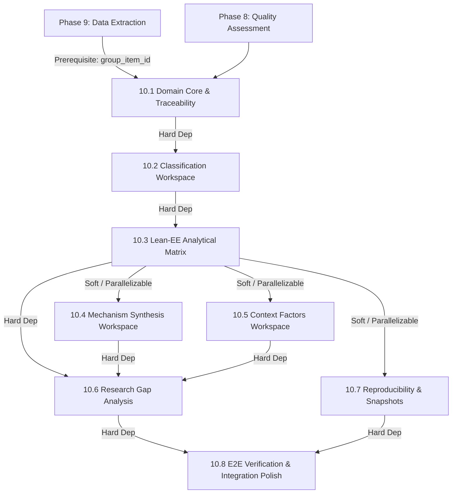

# Phase 10 — Data Synthesis / Synteza Danych
## Comprehensive Architecture & Implementation Plan

> **System**: SLR Platform  
> **Target Version**: `0.5.0` (Planned)  
> **Status**: ARCHITECTURE & BACKLOG SPECIFICATION ONLY — DO NOT IMPLEMENT  
> **Methodological Standard**: SLR Protocol version 1.0 (11.08.2026) — Chapters IX, X, XI, XII  
> **Domain Focus**: Evidence Synthesis Engine (Lean Management → Energy Efficiency Relations, Mechanisms, Context & Research Gaps)

---

## 1. Purpose

The purpose of Phase 10 (Evidence Synthesis / Synteza Danych) is to organize, integrate, and synthesize structured research evidence extracted in Phase 9 from studies included in the Systematic Literature Review (SLR). 

The primary objective is to answer research questions concerning the relationship between **Lean Management practices** and **Energy Efficiency (EE) outcomes** in manufacturing enterprises by:
1. Classifying practices and energy indicators into normalized analytical categories without losing original source values.
2. Mapping and analyzing 1:N **Lean–EE relationships** as the fundamental unit of synthesis, bound strictly to a durable logical identity (`group_item_id`).
3. Constructing an interactive **Lean–EE Analytical Matrix** (`Lean Category` × `Energy Effect Category`) with multi-dimensional evidence characterization.
4. Synthesizing impact pathways, strictly distinguishing verbatim source evidence (`source_mechanism_text`) from reviewer-coded analytical categories (`analytical_mechanism_category`).
5. Analyzing organizational, technological, and process-related contextual conditions that condition, strengthen, or weaken energy effects.
6. Identifying research gaps across 5 distinct dimensions (thematic, mechanism, methodological, contextual, and inconsistent evidence) using transparent evidence criteria rather than publication count alone.
7. Integrating criterion-level Quality Assessment (Phase 8) profiles into synthesis interpretation without collapsing quality into arbitrary single numerical scores.
8. Providing a 100% deterministic, human-driven analytical workflow without built-in AI/LLM dependencies inside the application.
9. Ensuring end-to-end reproducibility through immutable **Synthesis Snapshots**.

---

## 2. Methodological Requirements (SLR Protocol v1.0) & AI Scope Boundary

This plan is directly grounded in **SLR Protocol version 1.0 (11.08.2026)**:

### 2.1 Chapter X — Data Extraction & Phase 9 Baseline
- Phase 9 extracts 1:N repeating group items (`lean_ee_relationships`) containing fields E4–E11 alongside publication context fields E1–E3, E12–E14.
- Explicit missingness states (`PRESENT`, `NOT_REPORTED`, `NOT_APPLICABLE`, `UNCLEAR`) and value origins (`REPORTED`, `REVIEWER_CODED`) are preserved.

### 2.2 Chapter XI — Data Synthesis
- **Fundamental Unit**: The unit of synthesis is **not the publication**, but the individual **Lean–EE relation**. A single paper may yield multiple practices, multiple energy indicators, and multiple distinct relations.
- **Terminology Normalization**: Original terms must be retained as `source_value`. Analytical categories (`analytical_category`) are mapped on top. $source\_value \neq analytical\_category$. Both remain queryable.
- **No Indiscriminate Metric Pooling**: Energy metrics (total energy use, unit consumption, energy intensity, peak power, energy efficiency) differ conceptually and must NOT be combined into a pseudo-meta-analysis.
- **Evidence Characterization**: Each relation is characterized by direction ($+$, $-$, $0$, mixed, cannot determine), effect magnitude, original unit, transformed value/unit (if deterministically converted via approved rules), evidence character (empirical, qualitative, estimated, postulated), context, and QA criteria profile.
- **Mechanism Synthesis**: Structured pathway analysis:
  $$\text{Analytical Category} \rightarrow \text{Source Mechanism Text} \rightarrow \text{Lean--EE Relation} \rightarrow \text{Extraction} \rightarrow \text{Publication}$$
  Strict boundary: Verbatim source text (`source_mechanism_text`) is source evidence; `analytical_mechanism_category` is reviewer interpretation.
- **Contextual Factors**: Categorized into organizational, technological, and process-related factors (open vocabulary).
- **Research Gaps**: Multi-criteria evaluation across 5 gap types:
  1. *Thematic gap*: Under-studied practices/effects/combinations.
  2. *Mechanism gap*: Reported effects without plausible mechanism explanations.
  3. *Methodological gap*: Recurring study design or measurement limitations.
  4. *Contextual gap*: Missing evidence in specific industries, countries, or scales.
  5. *Inconsistent evidence gap*: Conflicting results not explainable by context or methodology.
  *Critical rule*: Low publication count is NOT the sole criterion for a gap.

### 2.3 Chapter IX — Quality Assessment Integration
- Quality is evaluated via criterion profiles (e.g. QA1–QA7 responses: `YES`, `NO`, `CANNOT_DETERMINE` + justification).
- Quality MUST NOT be reduced to a single score (e.g. 5/7) or arbitrary tier (`LOW`/`MEDIUM`/`HIGH`). Synthesis must expose criterion-level profiles during interpretation.

### 2.4 Chapter XII — Protocol Context & Strict AI Scope Boundary
- **Methodological Context**: Chapter XII of the SLR Protocol describes the use of AI/LLM tools as external assistance to the researcher during research activities.
- **Strict Application Boundary**: **SLR Platform DOES NOT implement built-in AI/LLM functionality**.
  - All AI/LLM proposal adapters, LLM provider integrations, `synthesis_ai_events`, AI recommendation payloads, and automated classification tools are **EXCLUDED from the application scope**.
  - The application provides 100% deterministic research tools. Interpretive and classification decisions are made solely by human researchers within the application workspace.
  - Reproducibility in SLR Platform is strictly deterministic and does NOT depend on external LLM availability, API quotas, or stochastic model behavior.
- **Deterministic Researcher Workflow**:
  $$\text{Source Extracted Data} \rightarrow \text{Analytical Workspace} \rightarrow \text{Researcher Classification / Interpretation} \rightarrow \text{Approved Synthesis Result}$$

---

## 3. Mandatory Phase 9 Contract Prerequisite & Relation Identification Strategy

### 3.1 Required Contract: Durable `group_item_id` Across Revisions
Phase 10 establishes a strict architectural contract for Lean–EE relationship identity:

1. **`group_item_id` (Durable Logical Relation Identity)**: Every extracted Lean–EE relationship possesses a durable UUID (`group_item_id`) assigned when the relation is first created during extraction. This UUID **MUST be preserved across all subsequent extraction revisions** of that publication.
2. **`revision_id` (Extraction Snapshot)**: Represents a specific append-only extraction revision.
3. **`occurrence_record`**: The snapshot representation of that relation (`group_item_id`) within a specific extraction revision (`revision_id`, `item_index`).

```
Revision 1:
  - Relation A -> group_item_id = "uuid-A", item_index = 1
  - Relation B -> group_item_id = "uuid-B", item_index = 2

Revision 2 (Relation X inserted at top):
  - Relation X -> group_item_id = "uuid-X", item_index = 1 (NEW relation)
  - Relation A -> group_item_id = "uuid-A", item_index = 2 (STABLE identity preserved)
  - Relation B -> group_item_id = "uuid-B", item_index = 3 (STABLE identity preserved)
```

> [!IMPORTANT]
> **Phase 10 Entry Prerequisite / Required Phase 9 Architectural Correction**:
> If the current Phase 9 implementation does not strictly enforce the preservation of `group_item_id` when editing existing group items across revisions, **Phase 9 MUST be updated to enforce this contract before Phase 10 execution begins**. Phase 10 will NOT attempt to reconstruct relation identity using content heuristics.

### 3.2 Role of Content Fingerprinting: Diagnostic & Advisory Only
Content fingerprinting ($\text{SHA256}(\text{publication\_id} + \text{source\_practice} + \text{source\_effect})$) is **degraded to diagnostic / advisory purposes only**:
- **Permitted Uses**: Data migration diagnostics, duplicate candidate detection, suggesting potential matches to the researcher during manual data cleanup.
- **FORBIDDEN Uses**: Content fingerprinting MUST NOT automatically assign `logical_relation_id`, MUST NOT automatically merge revisions, MUST NOT replace `group_item_id`, and MUST NOT serve as the basis for provenance tracing.

---

## 4. Core Domain Model

```
┌────────────────────────────────────────────────────────────────────────────────────────┐
│                                    SynthesisSnapshot                                   │
│ (project_id, version, extraction_dataset_hash, classification_version, created_at, actor)│
└────────────────────────────────────────────────────────────────────────────────────────┘
                                           │ 1:N
                                           ▼
┌────────────────────────────────────────────────────────────────────────────────────────┐
│                                   AnalyticalRelation                                   │
│  (group_item_id: UUID [Durable FK], publication_id, latest_revision_id, item_index,   │
│   source_practice, analytical_lean_category_id, source_effect,                        │
│   analytical_energy_category_id, direction, magnitude, original_unit,                 │
│   transformed_value, transformed_unit, conversion_rule, evidence_character,           │
│   qa_profile, context_summary, approval_state)                                         │
└────────────────────────────────────────────────────────────────────────────────────────┘
            │ 1:N                                      │ 1:N                         │ 1:N
            ▼                                          ▼                             ▼
┌──────────────────────┐                    ┌──────────────────────┐      ┌─────────────────────┐
│  MechanismPathway    │                    │  ContextFactorLink   │      │  ResearchGapLink    │
│ (pathway_id, type:   │                    │ (link_id, category:  │      │ (gap_id, gap_type:  │
│ SOURCE_REPORTED vs   │                    │ ORGANIZATIONAL,      │      │ THEMATIC, MECHANISM,│
│ REVIEW_SYNTHESIZED,  │                    │ TECHNOLOGICAL,       │      │ METHODOLOGICAL,     │
│ source_mechanism_text│                    │ PROCESS, factor_term,│      │ CONTEXTUAL,         │
│ -> analytical_cat)   │                    │ impact_type: ENABLE, │      │ INCONSISTENT,       │
│                      │                    │ STRENGTHEN, WEAKEN)  │      │ justification)      │
└──────────────────────┘                    └──────────────────────┘      └─────────────────────┘
```

### 4.1 Unit Conversion Model: Hybrid Helper Strategy

Phase 10 adopts a **Hybrid Helper** model for unit conversions:
1. **Source Values Immutable**: Original extracted values (`float_value`, `unit_value`) remain strictly unchanged.
2. **Deterministic Conversions for Standard Physical Units**: The system supports deterministic conversion calculation for mathematically unambiguous physical units:
   - Energy: Joules ($J$, $kJ$, $MJ$, $GJ$), Watt-hours ($Wh$, $kWh$, $MWh$).
3. **Separate Storage & Rule Traceability**:
   - `transformed_value`: Calculated converted numeric value.
   - `transformed_unit`: Target standard unit.
   - `conversion_rule`: Explicit formula/ratio applied (e.g. `1 kWh = 3.6 MJ`).
4. **Researcher Approval Required**: Converted values are NOT stored automatically; they require explicit researcher review and approval (`Save Converted Value`).
5. **No Automatic Cross-Metric Conversion**: Conversions between conceptually distinct indicators (e.g. total energy consumption $\leftrightarrow$ specific energy consumption per ton) are **STRICTLY FORBIDDEN** as unit conversions.

### 4.2 Mechanism Abstraction Model: Source Evidence vs. Analytical Interpretation

Phase 10 explicitly separates verbatim source text from reviewer classifications:
- **Source Evidence**: `source_mechanism_text` (Verbatim snippet extracted from paper in Phase 9 E10).
- **Analytical Interpretation**: `analytical_mechanism_category` (Reviewer-coded category created during synthesis).
- **Optional Hierarchy**: Optional analytical taxonomy (`mechanism_family` $\rightarrow$ `mechanism_category`).
- **Traceability Chain**:
  $$\text{Analytical Category} \rightarrow \text{Source Mechanism Text} \rightarrow \text{Lean--EE Relation (group\_item\_id)} \rightarrow \text{Extraction} \rightarrow \text{Publication}$$

---

## 5. Vertical Slice Backlog & Navigation Integration

Each vertical slice delivers a complete, usable product increment: $Domain \rightarrow Persistence \rightarrow API \rightarrow UI \rightarrow Navigation \rightarrow Tests$. Users can access each workspace immediately upon release of its corresponding increment.

---

### Task 10.1 — Data Synthesis Domain Core & Traceability Infrastructure
- **Goal**: Establish pure Python domain objects, enums, value objects, `group_item_id` validation engine, and Phase 9/8 read adapters.
- **Rationale for Domain/Infrastructure-only**: Fundamental domain models and relation resolution algorithms must be verified with 100% unit test coverage before creating database tables or REST schemas.
- **Scope**:
  - `AnalyticalRelation`, `RelationDirection`, `EvidenceCharacter`, `LeanPracticeCategory`, `EnergyEffectCategory`, `ClassificationApprovalState`.
  - Relation validation engine ensuring `group_item_id` is durable across extraction revisions.
  - QA profile aggregation adapter consuming Phase 8 `QualityAssessment`.
- **Data Model Changes**: None (In-memory domain models).
- **Backend/API**: `app/domain/synthesis.py`, `app/adapters/synthesis_extraction_adapter.py`.
- **UI / Navigation**: None.
- **Tests**: Unit test suite `tests/unit/domain/test_synthesis_domain.py` verifying relation ID integrity, missingness rules, unit conversion rules, and QA profile mapping.
- **Dependencies**: Phase 9 (`group_item_id` contract), Phase 8 (QA).
- **Acceptance Criteria**: 100% test coverage; invalid `group_item_id` updates fail validation cleanly.
- **Out of Scope**: Database tables, REST endpoints, UI.
- **Risks**: Phase 9 backend must satisfy `group_item_id` contract.

---

### Task 10.2 — Terminology Classification Workspace (Vertical Slice)
- **Goal**: Deliver end-to-end terminology classification allowing researchers to map extracted source terms ($source\_value \neq analytical\_category$), manage versioned category dictionaries, approve mappings, and access the workspace directly via GUI navigation.
- **Scope**:
  - *Backend*: Migration `0019_data_synthesis.sql` (tables `synthesis_lean_categories`, `synthesis_energy_categories`, `synthesis_term_mappings`), `SqliteSynthesisClassificationRepository`, `SynthesisClassificationService`, REST endpoints `GET/PUT /projects/{id}/synthesis/classifications`, `POST /projects/{id}/synthesis/classifications/approve`.
  - *UI & Navigation*: `ClassificationWorkspace.tsx` component with side-by-side term mapping tables, category management modals, approval badges, and routing integration in `EvidenceSynthesisPage.tsx` navigation header.
- **Data Model Changes**: Migration `0019_data_synthesis.sql`.
- **Backend/API**: `app/repositories/synthesis_repository.py`, `app/services/synthesis_classification_service.py`, `app/api/routers/synthesis_classification.py`.
- **UI / Navigation**: `frontend/src/components/synthesis/ClassificationWorkspace.tsx`, routing tab in `EvidenceSynthesisPage.tsx`.
- **Tests**: Repository & service unit tests, API integration tests (`tests/integration/api/test_synthesis_classification_api.py`), Vitest UI suite (`frontend/tests/ClassificationWorkspace.test.tsx`).
- **Dependencies**: Task 10.1.
- **Acceptance Criteria**: Full CRUD for categories and mappings; source terms preserved; UI reachable directly from application navigation.
- **Out of Scope**: Aggregation matrix, mechanisms.
- **Risks**: None.

---

### Task 10.3 — Lean–EE Analytical Matrix & Evidence Aggregation (Vertical Slice)
- **Goal**: Deliver end-to-end $M \times N$ analytical matrix grid (`Lean Category` × `Energy Effect Category`) with multi-dimensional evidence breakdowns, QA overlays, and direct GUI navigation.
- **Scope**:
  - *Backend*: Table `synthesis_analytical_relations`, aggregation engine computing relation count, publication count, direction distribution, evidence character breakdown, and QA criteria profile per cell. Non-pooling guardrails. Hybrid unit conversion helper endpoint. REST endpoints `GET /projects/{id}/synthesis/matrix`, `GET /projects/{id}/synthesis/matrix/cell-detail`, `POST /projects/{id}/synthesis/relations/{id}/convert-unit`.
  - *UI & Navigation*: `LeanEEMatrix.tsx` interactive grid component, cell click drill-down modal, QA profile overlay drawer, unit conversion helper modal, and routing integration in `EvidenceSynthesisPage.tsx`.
- **Data Model Changes**: Table `synthesis_analytical_relations`.
- **Backend/API**: `app/services/synthesis_matrix_service.py`, `app/api/routers/synthesis_matrix.py`.
- **UI / Navigation**: `frontend/src/components/synthesis/LeanEEMatrix.tsx`, `frontend/src/components/synthesis/MatrixCellDetailModal.tsx`.
- **Tests**: Integration test suite for matrix calculation and non-pooling guardrails (`tests/integration/services/test_synthesis_matrix.py`), Vitest grid rendering tests.
- **Dependencies**: Task 10.2.
- **Acceptance Criteria**: Matrix cell click drills down to exact relations and source PDF quotes; physical unit conversion helper requires explicit researcher approval; UI reachable via tab navigation.
- **Out of Scope**: Mechanism synthesis, context factors.
- **Risks**: None.

---

### Task 10.4 — Mechanism Synthesis Subsystem (Vertical Slice)
- **Goal**: Deliver end-to-end mechanism pathway builder with strict distinction between `source_mechanism_text` (evidence) and `analytical_mechanism_category` (interpretation), accessible directly via GUI navigation.
- **Scope**:
  - *Backend*: Tables `synthesis_mechanisms`, `synthesis_mechanism_links`. Service handling pathway creation, grouping, and origin attribution (`is_review_synthesized`). REST endpoints `GET/POST/PUT /projects/{id}/synthesis/mechanisms`.
  - *UI & Navigation*: `MechanismWorkspace.tsx` visual pathway builder component, `SOURCE_REPORTED` vs `REVIEW_SYNTHESIZED` toggle badges, verbatim quote drawer, and routing integration in `EvidenceSynthesisPage.tsx`.
- **Data Model Changes**: Tables `synthesis_mechanisms`, `synthesis_mechanism_links`.
- **Backend/API**: `app/services/synthesis_mechanism_service.py`, `app/api/routers/synthesis_mechanisms.py`.
- **UI / Navigation**: `frontend/src/components/synthesis/MechanismWorkspace.tsx`, `frontend/src/components/synthesis/PathwayBuilderModal.tsx`.
- **Tests**: Backend unit/integration tests (`tests/integration/api/test_synthesis_mechanisms_api.py`), Vitest pathway builder tests.
- **Dependencies**: Task 10.3 (Soft dependency: parallelizable with 10.5).
- **Acceptance Criteria**: Verbatim source text is stored as a provenance artifact separate from analytical categories; UI accessible via main synthesis navigation.
- **Out of Scope**: Context factors.
- **Risks**: None.

---

### Task 10.5 — Context & Moderating Conditions Analysis (Vertical Slice)
- **Goal**: Deliver end-to-end analysis workspace for organizational, technological, and process-related contextual factors, reachable via GUI navigation.
- **Scope**:
  - *Backend*: Tables `synthesis_context_categories`, `synthesis_relation_context_links`. Context service managing categories and impact links (`ENABLE`, `STRENGTHEN`, `WEAKEN`, `CONDITION`). REST endpoints `GET/POST/PUT /projects/{id}/synthesis/context-factors`.
  - *UI & Navigation*: `ContextWorkspace.tsx` component with factor category cards, impact toggle buttons, relation association drawers, and routing integration in `EvidenceSynthesisPage.tsx`.
- **Data Model Changes**: Tables `synthesis_context_categories`, `synthesis_relation_context_links`.
- **Backend/API**: `app/services/synthesis_context_service.py`, `app/api/routers/synthesis_context.py`.
- **UI / Navigation**: `frontend/src/components/synthesis/ContextWorkspace.tsx`.
- **Tests**: Backend unit tests (`tests/unit/services/test_synthesis_context.py`), Vitest context workspace tests.
- **Dependencies**: Task 10.3 (Soft dependency: parallelizable with 10.4).
- **Acceptance Criteria**: Context factors support data-driven category creation; links to relations retain source provenance; UI accessible via tab navigation.
- **Out of Scope**: Research gaps.
- **Risks**: None.

---

### Task 10.6 — Research Gap Analysis & Gap Matrix (Vertical Slice)
- **Goal**: Deliver end-to-end research gap identification matrix across 5 dimensions, accessible via GUI navigation.
- **Scope**:
  - *Backend*: Table `synthesis_research_gaps`. Multi-dimensional gap engine requiring evidence linkages for every gap assertion. REST endpoints `GET/POST/PUT /projects/{id}/synthesis/research-gaps`.
  - *UI & Navigation*: `ResearchGapsWorkspace.tsx` multi-dimensional matrix view, gap rationale authoring form, supporting evidence link selector, and routing integration in `EvidenceSynthesisPage.tsx`.
- **Data Model Changes**: Table `synthesis_research_gaps`.
- **Backend/API**: `app/services/synthesis_gap_service.py`, `app/api/routers/synthesis_gaps.py`.
- **UI / Navigation**: `frontend/src/components/synthesis/ResearchGapsWorkspace.tsx`.
- **Tests**: Gap justification backend tests, Vitest gap matrix UI tests.
- **Dependencies**: Tasks 10.3, 10.4, 10.5 (Hard dependencies).
- **Acceptance Criteria**: Publication count is not the sole gap criterion; every gap entry maintains traceable links to empirical evidence; UI accessible via tab navigation.
- **Out of Scope**: Snapshot export.
- **Risks**: None.

---

### Task 10.7 — Synthesis Reproducibility & Snapshot Engine (Vertical Slice)
- **Goal**: Deliver end-to-end immutable snapshot creation, dataset state hashing, snapshot management UI, and JSON/CSV dataset exports.
- **Scope**:
  - *Backend*: Table `synthesis_snapshots`. Snapshot engine computing SHA-256 hashes of input extraction dataset, classification rules, and QA configurations. JSON/CSV synthesis dataset exporter. REST endpoints `POST /projects/{id}/synthesis/snapshots`, `GET /projects/{id}/synthesis/snapshots`, `GET /projects/{id}/synthesis/snapshots/{version}/export`.
  - *UI & Navigation*: `SynthesisOverview.tsx` snapshot management section, dataset integrity badge, export buttons, and routing integration in `EvidenceSynthesisPage.tsx`.
- **Data Model Changes**: Table `synthesis_snapshots`.
- **Backend/API**: `app/services/synthesis_snapshot_service.py`, `app/api/routers/synthesis_snapshots.py`.
- **UI / Navigation**: Integrated into `frontend/src/components/synthesis/SynthesisOverview.tsx`.
- **Tests**: Snapshot hashing unit tests (`tests/unit/services/test_synthesis_snapshots.py`), export contract integration tests.
- **Dependencies**: Task 10.3 (Hard dependency).
- **Acceptance Criteria**: Exported CSV/JSON snapshots allow complete external reconstruction of synthesis matrices without data loss; UI accessible via Overview tab.
- **Out of Scope**: None.
- **Risks**: None.

---

### Task 10.8 — E2E Synthesis Verification, Polish & Cross-Module Integration
- **Goal**: End-to-end verification, cross-module integration polish, provenance drill-down validation, regression testing, and documentation alignment.
- **Role**: Task 10.8 is NOT the point where features first become accessible. It serves exclusively for system verification, cross-module drill-down validation, and release readiness.
- **Scope**:
  - End-to-end verification suite testing complete flow: Extraction Ingestion $\rightarrow$ Terminology Mapping $\rightarrow$ Matrix Aggregation $\rightarrow$ Mechanism Pathways $\rightarrow$ Context Factors $\rightarrow$ Research Gaps $\rightarrow$ Reproducibility Snapshot.
  - Verification of 6-level bidirectional provenance drill-down across all UI modules.
  - Performance benchmarking, regression testing, OpenAPI contract alignment, and release documentation.
- **Data Model Changes**: None.
- **Backend/API**: `tests/integration/synthesis/test_synthesis_e2e.py`.
- **UI**: Cross-module navigation polish and visual consistency checks.
- **Tests**: E2E test suite across all 8 increments.
- **Dependencies**: All prior tasks (10.1–10.7).
- **Acceptance Criteria**: All backend and frontend quality gates pass cleanly (`pytest`, `vitest`, `ruff`, `mypy`, `tsc`, `build clean`).
- **Out of Scope**: New functional feature development.
- **Risks**: None.

---

## 6. Dependency Graph



---

## 7. Open Decisions

1. **Phase 9 `group_item_id` Preservation Verification**:
   - *Status*: Open prerequisite decision.
   - *Requirement*: Phase 9 extraction implementation must be audited to verify that editing an existing group item in the UI preserves its `group_item_id` (UUID) in subsequent revisions rather than creating a new UUID. If not currently preserved, a small Phase 9 update must be applied prior to Phase 10 execution.

2. **Standard Physical Units Dictionary Scope**:
   - *Status*: Open configuration decision.
   - *Requirement*: Confirm the initial built-in list of physical energy units for the Task 10.3 Hybrid Conversion Helper ($J$, $kJ$, $MJ$, $GJ$, $Wh$, $kWh$, $MWh$).
