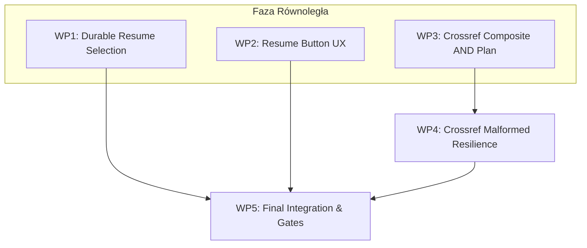

# SLR Platform — Plan v0.6.8: Provider Resume & Crossref Search Correctness

## 1. Executive Summary

Wersja **v0.6.8** stanowi pakiet architektoniczny i jakościowy dla modułu wyszukiwania (Search Pipeline) w SLR Platform, wynikający z testów produkcyjnych po wdrożeniu hotfixa wydajnościowego.

Główne cele:
1. **Durable Resumable Job Selection (OpenAlex / Fetch All)**: Trwałe, precyzyjne wznawianie konkretnego zadania pobierania (`job_id` / `search_run_id`), w pełni niezależne od późniejszego uruchomienia innych providerów (Crossref, Semantic Scholar), odświeżenia strony, zamknięcia przeglądarki oraz restartu backendu.
2. **Resume Button UX**: Poprawa ergonomii i widoczności przycisku „Wznów pobieranie” w `FetchAllProgressPanel` (spójność kontrolki z „Anuluj pobieranie”, polska etykieta bez sufiksu `(Resume)`, dedykowana ikona, pełna dostępność klawiatury).
3. **Crossref Search Correctness (Bounded Multi-Anchor AND Plan)**: Wyeliminowanie masowego szumu dziedzinowego (np. medycznego) wynikającego z pojedynczej szerokiej gałęzi `min(non_empty, key=len)` przy `INDETERMINATE` w polityce recall-first, poprzez deterministyczny plan zapytań łączący kluczowe grupy AND bez eksplozji kartezjańskiej.
4. **Crossref Malformed-Record Resilience**: Izolacja per-record błędów metadanych API (np. brak pola `title` / `ValueError`), zapewniająca nieprzerwaną paginację z audytowalnym ostrzeżeniem.
5. **Precyzyjny Audyt i Bramki Jakościowe**: Transparentne raportowanie metryk i twarde testy regresyjne oparte o zestawy *known-positive* oraz *known-negative*.

---

## 2. Analiza Problemów i Wymagania Jakościowe

### A. OpenAlex / Fetch All — Durable Resume

#### Kontekst i Diagnoza
- W teście produkcyjnym OpenAlex zgłosił ~27 021 wyników, pobrał 2400 (po lokalnych filtrach 404), po czym zwrócił `HTTP 429 Too Many Requests`. Stan został poprawnie zapisany w tabeli SQLite `search_run_checkpoints` jako `partial` + `resumable=1`.
- Problem: `ProjectContext.tsx` utrzymywał `fetchAllJob` tylko w ulotnym stanie komponentu React. Po odświeżeniu strony stan stawał się `null`.
- Endpoint bezparametrowy `POST /fetch-all/resume` odczytywał najnowszy `job_id` w projekcie. Uruchomienie w międzyczasie zapytania do Crossref uniemożliwiało późniejsze wznowienie pobierania z OpenAlex.

#### Twarde Wymagania Architektoniczne
1. **Identyfikacja konkretnego zadania**: API udostępnia endpoint `GET /projects/{project_id}/search-strategy/executions/resumable` zwracający listę wznawialnych zadań z ich identyfikatorami, providerami, czasem wykonania i liczbą pobranych rekordów.
2. **Wznawianie po `job_id`**: Wywołanie `POST /projects/{project_id}/search-strategy/executions/fetch-all/{job_id}/resume` wznawia dokładnie wskazany job.
3. **Trwałość bezstanowa**: Strategia i kursor są odczytywane z `plan_metadata` w SQLite — mechanizm działa po restarcie backendu bez danych w pamięci RAM.
4. **Brak duplikacji i pomijanie pobranych stron**: Użycie zapisanego kursora gwarantuje brak ponownego pobierania pierwszych 2400 rekordów oraz brak duplikowania wpisów w `search_result_snapshots`.
5. **Niezależność od innych providerów**: Wznowienie zadania OpenAlex działa poprawnie nawet po wielokrotnym uruchomieniu Crossref czy Semantic Scholar w tym samym projekcie.

---

### B. UX — Przycisk „Wznów pobieranie”

#### Wymagania Interfejsu
- **Etykieta**: „Wznów pobieranie” (bez technicznego sufiksu `(Resume)`).
- **Spójność wizualna**: Ten sam typ kontrolki co przycisk „Anuluj pobieranie” (podobne wymiary, wyraźne obramowanie `var(--border-strong)`, odpowiedni padding, spójne tło).
- **Ikona**: Ikona akcji wznowienia (`RotateCw` lub `Play` z `lucide-react`, 14px).
- **Dostępność i stany**: Widoczne stany `:hover`, `:focus-visible`, wsparcie nawigacji klawiaturą, brak polegania wyłącznie na barwie (obecność ikony i tekstu).
- **Warunki renderowania**: Widoczny wyłącznie w stanach `partial`, `cancelled` lub `failed`, gdy punkt kontrolny ma `resumable === true`.

---

### C. Crossref — Search Correctness & Bounded Multi-Anchor AND Plan

#### Diagnoza Przyczyny Źródłowej Szumu
1. Canonical query dla SLR ma strukturę:
   $$\left(\text{Lean terms}\right) \land \left(\text{Energy terms}\right) \land \left(\text{Manufacturing terms}\right)$$
2. Dotychczasowy renderer w `build_crossref_candidate_queries` wybierał gałąź o najmniejszej liczbie terminów (`min(non_empty, key=len)`). W efekcie wysyłał do Crossref zapytania o pojedynczy termin (np. sam `"Lean Management"` lub `"Kaizen"`).
3. Crossref zwracał publikacje medyczne i ogólne (np. *Management of side effects in medical abortion*, *Endovascular management of arterial intimal defects*).
4. Rekordy te w Crossref nie posiadają abstraktu. Walidator kanoniczny, nie mogąc wykluczyć spełnienia pozostałych bloków AND w brakującym tekście, nadawał status `INDETERMINATE`.
5. W ramach zasady **recall-first** rekordy `INDETERMINATE` były zachowywane, wprowadzając setki nieistotnych pozycji do zbioru końcowego.

#### Twarde Kryteria Jakościowe dla Crossref
1. **Zakaz pojedynczej szerokiej gałęzi**: Candidate retrieval nie może opierać się wyłącznie na pojedynczym terminie z jednej grupy.
2. **Zachowanie wszystkich grup AND w postaci ograniczonej (Bounded Composite AND Plan)**:
   - System identyfikuje wiodące terminy kotwiczące (anchors) z **każdej** grupy AND.
   - Tworzy deterministyczne zapytania kompozytowe łączące pojęcia ze wszystkich grup, np.:
     - `Query 1`: `"Lean Management" Energy Manufacturing`
     - `Query 2`: `"Lean Production" "Energy Efficiency" Industrial`
     - `Query 3`: `Kaizen "Energy Consumption" Factory`
     - `Query 4`: `"Continuous Improvement" "Energy Saving" Production`
     - `Query 5`: `"Lean Manufacturing" "Energy Consumption" Manufacturing`
     - `Query 6`: `Kaizen "Energy Efficiency" Industrial`
3. **Uzasadnienie limitu zapytań fizycznych (max 6 zapytań)**:
   - Ograniczenie planu do maksymalnie 6 zapytań fizycznych (zamiast iloczynu kartezjańskiego $5 \times 6 \times 4 = 120$ zapytań) gwarantuje:
     - brak ryzyka HTTP 429 i przekroczenia limitów Crossref REST API,
     - deterministyczny czas wykonania pojedynczej strony,
     - pokrycie kluczowych kombinacji synonimów dziedzinowych.
4. **Semantyka INDETERMINATE i Recall-first**:
   - Brak abstraktu **nie może** sam w sobie powodować odrzucenia publikacji (brak false negatives).
   - Status `INDETERMINATE` jest stosowany wyłącznie do zawężonej puli kandydatów (zwróconej przez zapytania kompozytowe), co eliminuje przepuszczanie masowego szumu.
5. **Fixtures Testowe (Known-Positive / Known-Negative)**:
   - **Known-Positive Fixtures** (muszą zostać zachowane):
     - Rekord A: Tytuł: *"Kaizen principles for improving energy efficiency in industrial plants"*, brak abstraktu -> zachowany (MATCH na tytule lub INDETERMINATE w puli kompozytowej).
     - Rekord B: Tytuł: *"Lean production implementation and energy performance in automotive manufacturing"*, abstrakt obecny -> zachowany (MATCH).
   - **Known-Negative Fixtures** (muszą zostać wykluczone na etapie retrieval lub jednoznacznie odrzucone):
     - *"Management of side effects and complications in medical abortion"*
     - *"Endovascular management of arterial intimal defects"*
     - *"Optimizing the management of blunt splenic injury"*
     Te rekordy nie mogą przechodzić do zbioru końcowego wyłącznie z powodu wystąpienia słowa „management”.
6. **Transparentność i Liczniki Audytu**:
   - Rejestracja w `SearchRun` i audycie niezależnych liczników:
     - `physical_requests`
     - `fetched_count`
     - `mapped_count`
     - `skipped_malformed_count`
     - `canonical_accepted_count` (MATCH)
     - `canonical_rejected_count` (NON_MATCH)
     - `canonical_indeterminate_count` (INDETERMINATE)
     - `deduplicated_count`

---

### D. Crossref — Odporność na Wadliwe Rekordy (Malformed Records)

#### Wymagania Odporności
1. **Izolacja per-record**:
   - Błąd walidacji pojedynczego rekordu (np. brak pola `title`, puste pole tytułu, nieprawidłowy format daty lub ORCID) jest przechwytywany w pętli mapowania `items`.
2. **Ciągłość paginacji**:
   - Wadliwy rekord jest pomijany, licznik `skipped_malformed_count` jest inkrementowany.
   - Paginacja **nie jest przerywana**, a status providera nie zmienia się na `failed`/`partial`, o ile pozostałe rekordy są poprawne i pobieranie kolejnych stron przebiega pomyślnie.
3. **Audyt i ostrzeżenia**:
   - Do listy ostrzeżeń `warnings` dodawany jest wpis informacyjny:
     `"1 Crossref record(s) skipped due to missing/malformed title or metadata validation."`
4. **Błędy krytyczne (niedozwolone do ignorowania)**:
   - Błędy sieciowe `httpx`, kody HTTP (429, 500, 502, 503), uszkodzenie głównej struktury JSON odpowiedzi oraz błędy kursorów paginacji są rzucane wyżej i skutkują retry lub kontrolowanym przerwaniem zadania.

---

## 3. Zakres Poza Wersją v0.6.8 (Out of Scope)

Dla zachowania stabilności i skupienia na celach wydania, z zakresu v0.6.8 **jednoznacznie wyłącza się**:
- Pełną przebudowę architektury Search na dedykowany rozproszony background worker (Celery/RQ).
- Ogólny asynchroniczny framework zadań dla całej platformy.
- Zmianę globalnej zasady *recall-first* dla pozostałych modułów przeglądu SLR.
- Usuwanie lub wygaszanie `MetadataEnrichmentService` (mechanizm pozostaje w architekturze jako opcjonalny moduł uzupełniający poza Live Search).
- Refaktoryzację i przebudowę pozostałych providerów (OpenAlex i Semantic Scholar zachowują obecne, stabilne renderery).

---

## 4. Pakiety Prac (Work Packages)

| WP | Zakres | Pliki do modyfikacji | Zależności | Główne Kryteria Akceptacji | Testy | Ryzyka | Równoległość | Sugerowany Agent / Model |
| :--- | :--- | :--- | :--- | :--- | :--- | :--- | :--- | :--- |
| **WP1** | **Durable Resumable Job Selection & OpenAlex Resume** | `app/api/routers/search_strategy.py` `app/repositories/search_run_checkpoint_repository.py` `app/services/fetch_all_search.py` `frontend/src/services/api/projectApi.ts` `frontend/src/context/ProjectContext.tsx` | Brak | 1. Endpoint `GET .../executions/resumable` zwraca wznawialne zadania projektu. 2. Resume wskazanego `job_id` działa po restarcie backendu i odświeżeniu UI. 3. Wykonanie innego providera nie blokuje wznowienia OpenAlex. 4. Brak ponownego pobierania pierwszych stron i duplikacji. | `test_fetch_all_search_resume.py` `test_search_strategy_api.py` `ProjectContextFetchAll.test.tsx` | Spójność metadanych strategii w SQLite | **TAK** | `Sonnet` / `Sol` |
| **WP2** | **Resume Button UX** | `frontend/src/components/search/FetchAllProgressPanel.tsx` `frontend/tests/FetchAllProgressPanel.test.tsx` | Brak | 1. Identyczny typ i styl kontrolki co „Anuluj pobieranie”. 2. Polska etykieta „Wznów pobieranie” bez `(Resume)`. 3. Ikona akcji (`RotateCw`/`Play`). 4. Pełna obsługa focus/hover/keyboard. 5. Widoczny tylko dla `resumable === true`. | `FetchAllProgressPanel.test.tsx` | Brak | **TAK** | `Flash` |
| **WP3** | **Crossref Candidate Retrieval Correctness** | `app/rendering/crossref.py` `app/providers/search/crossref.py` `tests/unit/rendering/test_crossref_rendering.py` `tests/unit/services/test_search_canonical_regression.py` | Brak | 1. Generowanie deterministycznego planu kompozytowego (max 6 zapytań łączących grupy AND). 2. Known-positive fixtures są odnajdywane/retained. 3. Known-negative fixtures (szum medyczny) są odrzucane. 4. INDETERMINATE zachowane dla puli kompozytowej bez eksplozji szumu. | `test_crossref_rendering.py` `test_search_canonical_regression.py` `test_crossref_provider.py` | Odpowiedni dobór wiodących terminów | **TAK** | `Sol` |
| **WP4** | **Crossref Malformed-Record Resilience** | `app/providers/search/crossref.py` `tests/unit/providers/test_crossref_provider.py` | Częściowo WP3 (ten sam plik providera) | 1. Rekord bez tytułu lub z błędną strukturą jest pomijany per-record. 2. Paginacja kolejnych stron trwa bez przerwania. 3. Inkrementacja licznika i wpis w `warnings`. 4. Błędy sieciowe i protokołu nadal przerywają proces. | `test_crossref_resilience.py` | Zbyt szeroki blok except (wyeliminowany przez precyzyjne typy) | **Po WP3** (lub wspólnie) | `Sonnet` / `Flash` |
| **WP5** | **Final Integration, Regression & Quality Gates** | `tests/integration/test_search_e2e.py` Weryfikacja całego repozytorium | WP1, WP2, WP3, WP4 | 1. `uv run pytest` (100% PASS). 2. `uv run ruff check .` (PASS). 3. `uv run mypy app` (PASS). 4. `git diff --check` (PASS). 5. `npm test` frontend (PASS). | Pełny zestaw testów E2E i regresyjnych | Regresja interakcji między modułami | **NA KOŃCU** | `Antigravity` + review `Sol`/`Sonnet` |

---

## 5. Zależności i Kolejność Realizacji

- **WP1, WP2, WP3** mogą rozpocząć się w pełni niezależnie i równolegle.
- **WP4** modyfikuje ten sam plik (`app/providers/search/crossref.py`) co WP3, dlatego rekomenduje się wykonanie WP4 bezpośrednio po sfinalizowaniu WP3 lub jako spójny etap w tym samym wątku prac.
- **WP5** uruchamiany jest po zintegrowaniu wszystkich pakietów WP1–WP4 do gałęzi roboczej.
